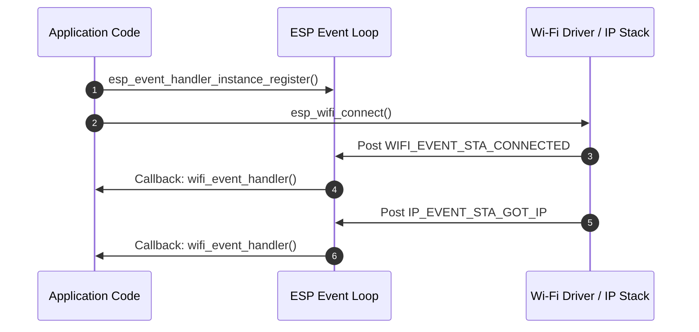
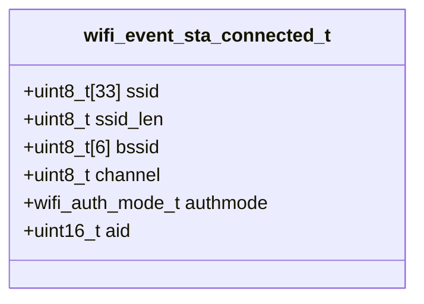
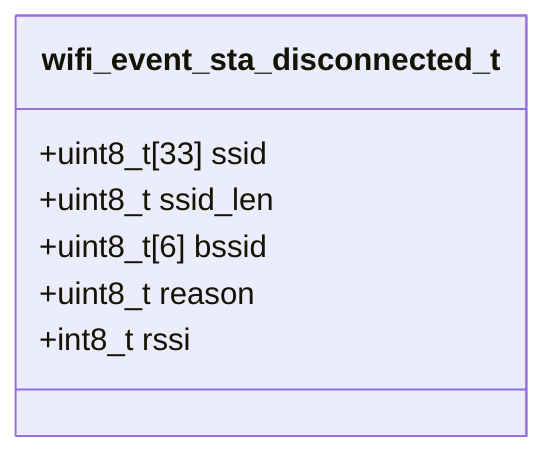
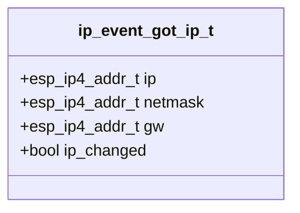

# ใบงานที่ 5.2: การยืนยันตัวตน การสถาปนาการเชื่อมต่อ และการรับหมายเลข IP Address (Wi-Fi Connection & IP Assignment)

## 0. กล่าวนำ (Introduction)
ใบงานนี้เป็นการทดลองต่อเนื่องจากใบงานที่ 5.1 (Scan Phase) เพื่อศึกษาและสังเกตกระบวนการสถาปนาการเชื่อมต่อแบบครบวงจรในเฟสที่ 2 (Authentication), เฟสที่ 3 (Association), เฟสที่ 4 (4-Way Handshake) และเฟสที่ 5 (IP Assignment / DHCP) ผ่านเฟรมเวิร์ก ESP-IDF 

นักศึกษาจะได้วิเคราะห์พฤติกรรมของระบบและอ่านค่า Log สไตล์ Forensic เมื่อเกิดเหตุการณ์เชื่อมต่อสำเร็จ (`WIFI_EVENT_STA_CONNECTED`, `IP_EVENT_STA_GOT_IP`) รวมถึงการตรวจสอบและถอดรหัส Disconnect Reason Code (`WIFI_EVENT_STA_DISCONNECTED`) เมื่อเกิดเหตุการณ์เชื่อมต่อล้มเหลว (เช่น SSID ผิด หรือ Password ผิด)

---

## 1. วัตถุประสงค์ (Objectives)
1. เรียนรู้กระบวนการเชื่อมต่อ Wi-Fi และการจัดสรรหมายเลข IP Address (DHCP Client) ในโหมด Station (`WIFI_STA`) บน ESP-IDF
2. เรียนรู้การใช้ Event Loop (`esp_event_handler_instance_register`) และ FreeRTOS Event Group ในการดักจับ Event ของระบบ Wi-Fi และ IP
3. อ่านและวิเคราะห์โครงสร้างข้อมูล Event ได้แก่ `wifi_event_sta_connected_t`, `wifi_event_sta_disconnected_t` และ `ip_event_got_ip_t`
4. ตรวจสอบและระบุสาเหตุของความล้มเหลวในการเชื่อมต่อ Wi-Fi จากค่า Disconnect Reason Code (เช่น `WIFI_REASON_NO_AP_FOUND` และ `WIFI_REASON_HANDSHAKE_TIMEOUT` / `AUTH_FAIL`)

---

## 2. อุปกรณ์และซอฟต์แวร์ที่ใช้ในการทดลอง (Equipment & Tools)
1. บอร์ดไมโครคอนโทรลเลอร์ ESP32 (เช่น ESP32 DevKit V1) จำนวน 1 บอร์ด
2. สายเชื่อมต่อ Micro-USB หรือ USB-C จำนวน 1 เส้น
3. คอมพิวเตอร์ที่ติดตั้งโปรแกรม IDE เช่น VS Code พร้อมทั้ง ESP-IDF (อาจจะติดตั้งบนเครื่องหรือบน Docker ก็ได้)

---

## 3. ความรู้พื้นฐานที่เกี่ยวข้อง (Theoretical Background - ESP-IDF Framework)

### 3.1 สถาปัตยกรรม Event Loop และ Event Handling ใน ESP-IDF
ใน ESP-IDF การทำงานของ Wi-Fi เป็นแบบ Asynchronous (ทำงานเบื้องหลัง) โดย Driver จะส่ง Event ผ่านระบบ **Default Event Loop** เพื่อแจ้งเตือนให้โปรแกรมทราบความคืบหน้า



### 3.2 โครงสร้างข้อมูล Event สำคัญ (Class Diagrams)

#### 1) โครงสร้างข้อมูล `wifi_event_sta_connected_t`
ส่งมาพร้อมกับ Event `WIFI_EVENT_STA_CONNECTED` เพื่อระบุรายละเอียดของ AP ที่เชื่อมต่อสำเร็จ:



#### 2) โครงสร้างข้อมูล `wifi_event_sta_disconnected_t`
ส่งมาพร้อมกับ Event `WIFI_EVENT_STA_DISCONNECTED` เพื่อระบุสาเหตุของการหลุดการเชื่อมต่อ:



#### 3) โครงสร้างข้อมูล `ip_event_got_ip_t`
ส่งมาพร้อมกับ Event `IP_EVENT_STA_GOT_IP` เมื่อ ESP32 ได้รับหมายเลข IP จาก DHCP Server:



---

## 4. ขั้นตอนและโปรแกรมทดสอบการทดลอง (Experimental Procedures)

ในใบงานนี้ จะทำการทดสอบการเชื่อมต่อ Wi-Fi ใน 3 สถานการณ์ย่อย เพื่อเปรียบเทียบ Forensic Log และ Disconnect Reason Code:

### 5.2.1 การเชื่อมต่อด้วย SSID และ Password ที่ถูกต้อง (Success Case)
กำหนดค่า SSID และ Password ที่ถูกต้องตามสภาพแวดล้อมจริง สังเกต Event `WIFI_EVENT_STA_CONNECTED` และ `IP_EVENT_STA_GOT_IP` พร้อมอ่านหมายเลข IP Address, Subnet Mask และ Gateway

### 5.2.2 การเชื่อมต่อด้วย SSID ที่ไม่มีอยู่จริง (Wrong SSID / No AP Found)
กำหนดค่า SSID สมมุติที่ไม่มีอยู่จริง (`"NON_EXISTENT_SSID_9999"`) สังเกต Event `WIFI_EVENT_STA_DISCONNECTED` และวิเคราะห์ค่า Reason Code ซึ่งต้องได้ `WIFI_REASON_NO_AP_FOUND` (Decimal 201 / Hex `0xC9`)

### 5.2.3 การเชื่อมต่อด้วย SSID ที่ถูกต้องแต่ Password ผิด (Wrong Password / Handshake Fail)
กำหนดค่า SSID ถูกต้องแต่ป้อน Password ผิด (`"WRONG_PASS_9999"`) สังเกต Event `WIFI_EVENT_STA_DISCONNECTED` ในขั้นตอน 4-Way Handshake และวิเคราะห์ค่า Reason Code ซึ่งต้องได้ `WIFI_REASON_HANDSHAKE_TIMEOUT` (15) หรือ `WIFI_REASON_AUTH_FAIL` (202 / 204)

---

## 5. ซอร์สโค้ดการทดลอง (Complete ESP-IDF Source Code - `main.c`)

ให้นักศึกษานำซอร์สโค้ด C ต่อไปนี้ไปวางในไฟล์ `main/main.c` ของโปรเจกต์ ESP-IDF ทำการ Build และ Flash ลงบอร์ด ESP32 จากนั้นเปิด ESP-IDF Monitor (Baud Rate `115200`) เพื่อสังเกตผลการทำงาน

==**หมายเหตุ** ใน source code ด้านล่าง  แนะนำให้ใช้ MY_SSID และ  MY_PASSWORD จาก mobile hotspot และต้องลบออกก่อน push ขึ้น git== 

```c
#include <stdio.h>
#include <string.h>
#include "freertos/FreeRTOS.h"
#include "freertos/task.h"
#include "freertos/event_groups.h"
#include "esp_system.h"
#include "esp_wifi.h"
#include "esp_event.h"
#include "esp_log.h"
#include "nvs_flash.h"
#include "esp_netif.h"

static const char *TAG = "LAB_WIFI_CONN";

/* FreeRTOS event group to signal when we are connected or failed */
static EventGroupHandle_t s_wifi_event_group;

#define WIFI_CONNECTED_BIT BIT0
#define WIFI_FAIL_BIT      BIT1

// Configurable target Wi-Fi credentials for successful test
#define EXAMPLE_ESP_WIFI_SSID      "MY_SSID"
#define EXAMPLE_ESP_WIFI_PASS      "MY_PASSWORD"

// Convert wifi_reason_code_t to readable string
static const char *get_disconnect_reason_name(uint8_t reason) {
  switch (reason) {
  case WIFI_REASON_UNSPECIFIED:
    return "WIFI_REASON_UNSPECIFIED (1)";
  case WIFI_REASON_AUTH_EXPIRE:
    return "WIFI_REASON_AUTH_EXPIRE (2)";
  case WIFI_REASON_AUTH_LEAVE:
    return "WIFI_REASON_AUTH_LEAVE (3)";
  case WIFI_REASON_ASSOC_EXPIRE:
    return "WIFI_REASON_ASSOC_EXPIRE (4)";
  case WIFI_REASON_ASSOC_FAIL:
    return "WIFI_REASON_ASSOC_FAIL (203)";
  case WIFI_REASON_NOT_AUTHED:
    return "WIFI_REASON_NOT_AUTHED (6)";
  case WIFI_REASON_HANDSHAKE_TIMEOUT:
    return "WIFI_REASON_HANDSHAKE_TIMEOUT (15)";
  case WIFI_REASON_NO_AP_FOUND:
    return "WIFI_REASON_NO_AP_FOUND (201)";
  case WIFI_REASON_AUTH_FAIL:
    return "WIFI_REASON_AUTH_FAIL (202)";
  case WIFI_REASON_4WAY_HANDSHAKE_TIMEOUT:
    return "WIFI_REASON_4WAY_HANDSHAKE_TIMEOUT (204)";
  case WIFI_REASON_CONNECTION_FAIL:
    return "WIFI_REASON_CONNECTION_FAIL (208)";
  case WIFI_REASON_BEACON_TIMEOUT:
    return "WIFI_REASON_BEACON_TIMEOUT (200)";
  default:
    return "OTHER_DISCONNECT_REASON";
  }
}

// Wi-Fi and IP Event Handler with Forensic Logging
static void wifi_event_handler(void *arg, esp_event_base_t event_base,
                               int32_t event_id, void *event_data) {
  if (event_base == WIFI_EVENT) {
    switch (event_id) {
    case WIFI_EVENT_STA_START:
      ESP_LOGI(TAG, "[EVENT FORENSIC]: WIFI_EVENT_STA_START received");
      ESP_LOGI(TAG, "[FORENSIC]: Call esp_wifi_connect()");
      esp_err_t err_conn = esp_wifi_connect();
      ESP_LOGI(TAG, "[FORENSIC]: esp_wifi_connect() returned %s (0x%x)",
               esp_err_to_name(err_conn), err_conn);
      break;

    case WIFI_EVENT_STA_CONNECTED: {
      wifi_event_sta_connected_t *event =
          (wifi_event_sta_connected_t *)event_data;
      ESP_LOGI(TAG, "=======================================================");
      ESP_LOGI(TAG, "[EVENT FORENSIC]: WIFI_EVENT_STA_CONNECTED received!");
      ESP_LOGI(TAG, "  -> Connected to SSID : %s", event->ssid);
      ESP_LOGI(TAG, "  -> BSSID            : %02X:%02X:%02X:%02X:%02X:%02X",
               event->bssid[0], event->bssid[1], event->bssid[2],
               event->bssid[3], event->bssid[4], event->bssid[5]);
      ESP_LOGI(TAG, "  -> Channel          : %d", event->channel);
      ESP_LOGI(TAG, "  -> Auth Mode        : %d", event->authmode);
      ESP_LOGI(TAG, "=======================================================");
      break;
    }

    case WIFI_EVENT_STA_DISCONNECTED: {
      wifi_event_sta_disconnected_t *event =
          (wifi_event_sta_disconnected_t *)event_data;
      ESP_LOGW(TAG, "=======================================================");
      ESP_LOGW(TAG, "[EVENT FORENSIC]: WIFI_EVENT_STA_DISCONNECTED received!");
      ESP_LOGW(TAG, "  -> Target SSID          : %s", event->ssid);
      ESP_LOGW(TAG, "  -> Reason Code (Decimal): %d", event->reason);
      ESP_LOGW(TAG, "  -> Reason Code (Hex)    : 0x%02X", event->reason);
      ESP_LOGW(TAG, "  -> Reason Description   : %s",
               get_disconnect_reason_name(event->reason));
      ESP_LOGW(TAG, "=======================================================");
      xEventGroupSetBits(s_wifi_event_group, WIFI_FAIL_BIT);
      break;
    }

    default:
      ESP_LOGI(TAG, "[EVENT FORENSIC]: WIFI_EVENT ID %ld received", event_id);
      break;
    }
  } else if (event_base == IP_EVENT) {
    if (event_id == IP_EVENT_STA_GOT_IP) {
      ip_event_got_ip_t *event = (ip_event_got_ip_t *)event_data;
      ESP_LOGI(TAG, "=======================================================");
      ESP_LOGI(TAG, "[EVENT FORENSIC]: IP_EVENT_STA_GOT_IP received!");
      ESP_LOGI(TAG, "  -> IP Address : " IPSTR, IP2STR(&event->ip_info.ip));
      ESP_LOGI(TAG, "  -> Netmask    : " IPSTR, IP2STR(&event->ip_info.netmask));
      ESP_LOGI(TAG, "  -> Gateway    : " IPSTR, IP2STR(&event->ip_info.gw));
      ESP_LOGI(TAG, "=======================================================");
      xEventGroupSetBits(s_wifi_event_group, WIFI_CONNECTED_BIT);
    }
  }
}

// Function to test Wi-Fi connection with specific config
static void test_wifi_connection(const char *test_title, const char *ssid,
                                  const char *password) {
  ESP_LOGI(TAG, "\n");
  ESP_LOGI(TAG, "------------------------------------------------------------------");
  ESP_LOGI(TAG, ">>> %s", test_title);
  ESP_LOGI(TAG, "------------------------------------------------------------------");
  ESP_LOGI(TAG, "  Target SSID: \"%s\"", ssid);
  ESP_LOGI(TAG, "  Target Password: \"%s\"", password);

  // Clear event bits
  xEventGroupClearBits(s_wifi_event_group, WIFI_CONNECTED_BIT | WIFI_FAIL_BIT);

  wifi_config_t wifi_config = {
      .sta = {
          .threshold.authmode = WIFI_AUTH_WPA2_PSK,
      },
  };
  strncpy((char *)wifi_config.sta.ssid, ssid, sizeof(wifi_config.sta.ssid));
  strncpy((char *)wifi_config.sta.password, password,
          sizeof(wifi_config.sta.password));

  ESP_LOGI(TAG, "[FORENSIC]: Call esp_wifi_stop()");
  esp_wifi_stop();

  ESP_LOGI(TAG, "[FORENSIC]: Call esp_wifi_set_config(WIFI_IF_STA, &wifi_config)");
  esp_err_t err_cfg = esp_wifi_set_config(WIFI_IF_STA, &wifi_config);
  ESP_LOGI(TAG, "[FORENSIC]: esp_wifi_set_config() returned %s (0x%x)",
           esp_err_to_name(err_cfg), err_cfg);

  ESP_LOGI(TAG, "[FORENSIC]: Call esp_wifi_start()");
  esp_err_t err_start = esp_wifi_start();
  ESP_LOGI(TAG, "[FORENSIC]: esp_wifi_start() returned %s (0x%x)",
           esp_err_to_name(err_start), err_start);

  /* Waiting until either the connection is established (WIFI_CONNECTED_BIT) or failed (WIFI_FAIL_BIT) */
  EventBits_t bits = xEventGroupWaitBits(s_wifi_event_group,
                                         WIFI_CONNECTED_BIT | WIFI_FAIL_BIT,
                                         pdFALSE, pdFALSE, pdMS_TO_TICKS(10000));

  if (bits & WIFI_CONNECTED_BIT) {
    ESP_LOGI(TAG, "[RESULT]: TEST PASSED - Connected to AP successfully!");
  } else if (bits & WIFI_FAIL_BIT) {
    ESP_LOGW(TAG, "[RESULT]: TEST FAILED - Disconnected event captured.");
  } else {
    ESP_LOGE(TAG, "[RESULT]: TEST TIMEOUT - Neither connected nor disconnected event received.");
  }
}

void app_main(void) {
  s_wifi_event_group = xEventGroupCreate();

  // 1. Initialize NVS Flash
  ESP_LOGI(TAG, "[FORENSIC]: Call nvs_flash_init()");
  esp_err_t ret = nvs_flash_init();
  ESP_LOGI(TAG, "[FORENSIC]: nvs_flash_init() returned %s (0x%x)",
           esp_err_to_name(ret), ret);
  if (ret == ESP_ERR_NVS_NO_FREE_PAGES ||
      ret == ESP_ERR_NVS_NEW_VERSION_FOUND) {
    ESP_LOGI(TAG, "[FORENSIC]: Call nvs_flash_erase()");
    ESP_ERROR_CHECK(nvs_flash_erase());
    ret = nvs_flash_init();
    ESP_LOGI(TAG, "[FORENSIC]: nvs_flash_init() retry returned %s (0x%x)",
             esp_err_to_name(ret), ret);
  }
  ESP_ERROR_CHECK(ret);

  // 2. Initialize Network Interface and Event Loop
  ESP_LOGI(TAG, "[FORENSIC]: Call esp_netif_init()");
  ESP_ERROR_CHECK(esp_netif_init());

  ESP_LOGI(TAG, "[FORENSIC]: Call esp_event_loop_create_default()");
  ESP_ERROR_CHECK(esp_event_loop_create_default());

  ESP_LOGI(TAG, "[FORENSIC]: Call esp_netif_create_default_wifi_sta()");
  esp_netif_t *sta_netif = esp_netif_create_default_wifi_sta();
  ESP_LOGI(TAG, "[FORENSIC]: esp_netif_create_default_wifi_sta() returned %p", sta_netif);

  // 3. Initialize Wi-Fi Driver
  wifi_init_config_t cfg = WIFI_INIT_CONFIG_DEFAULT();
  ESP_LOGI(TAG, "[FORENSIC]: Call esp_wifi_init(&cfg)");
  ESP_ERROR_CHECK(esp_wifi_init(&cfg));

  // 4. Register Event Handlers
  esp_event_handler_instance_t instance_any_id;
  esp_event_handler_instance_t instance_got_ip;
  ESP_LOGI(TAG, "[FORENSIC]: Call esp_event_handler_instance_register(WIFI_EVENT)");
  ESP_ERROR_CHECK(esp_event_handler_instance_register(
      WIFI_EVENT, ESP_EVENT_ANY_ID, &wifi_event_handler, NULL,
      &instance_any_id));

  ESP_LOGI(TAG, "[FORENSIC]: Call esp_event_handler_instance_register(IP_EVENT)");
  ESP_ERROR_CHECK(esp_event_handler_instance_register(
      IP_EVENT, IP_EVENT_STA_GOT_IP, &wifi_event_handler, NULL,
      &instance_got_ip));

  ESP_LOGI(TAG, "[FORENSIC]: Call esp_wifi_set_mode(WIFI_MODE_STA)");
  ESP_ERROR_CHECK(esp_wifi_set_mode(WIFI_MODE_STA));

  ESP_LOGI(TAG, "==================================================================");
  ESP_LOGI(TAG, "  Lab 5.2: Wi-Fi Connection & IP Assignment (ESP-IDF Forensic)");
  ESP_LOGI(TAG, "==================================================================");

  // ------------------------------------------------------------------
  // 5.2.1 Connecting with Correct SSID & Password (Success Case)
  // ------------------------------------------------------------------
  test_wifi_connection("Experiment 5.2.1: Connection Test - Correct Credentials",
                       EXAMPLE_ESP_WIFI_SSID, EXAMPLE_ESP_WIFI_PASS);

  vTaskDelay(pdMS_TO_TICKS(2000));

  // ------------------------------------------------------------------
  // 5.2.2 Connecting with Wrong SSID (Non-existent AP Case)
  // ------------------------------------------------------------------
  test_wifi_connection("Experiment 5.2.2: Connection Test - Wrong SSID (No AP Found)",
                       "NON_EXISTENT_SSID_9999", "12345678");

  vTaskDelay(pdMS_TO_TICKS(2000));

  // ------------------------------------------------------------------
  // 5.2.3 Connecting with Correct SSID but Wrong Password (Handshake Fail Case)
  // ------------------------------------------------------------------
  test_wifi_connection("Experiment 5.2.3: Connection Test - Wrong Password (Auth/Handshake Fail)",
                       EXAMPLE_ESP_WIFI_SSID, "WRONG_PASS_9999");

  ESP_LOGI(TAG, "==================================================================");
  ESP_LOGI(TAG, "  [Phase 2/3/4/5 Completed: Wi-Fi Connection Lab Finished]");
  ESP_LOGI(TAG, "==================================================================");
}
```

---

## 6. ตารางบันทึกผลการทดลอง (Experiment Results)

ให้นักศึกษาบันทึกผลลัพธ์จากการสังเกตใน Serial Console ลงในตารางต่อไปนี้:

### 6.1 ตารางสรุปเปรียบเทียบผลการทดลองทั้ง 3 สถานการณ์

| ข้อการทดลอง | สถานการณ์ทดสอบ | Event สุดท้ายที่ได้รับ | ผลลัพธ์ (Passed/Failed) | Reason Code (Decimal / Hex) | คำอธิบาย Reason Code |
| :---: | :--- | :---: | :---: | :---: | :--- |
| **5.2.1** | SSID และ Password ถูกต้อง | WIFI_EVENT_STA_CONNECTED | Failed (เนื่องจากหลุดหลังจาก Connect)* | 5 / 0x05 | OTHER_DISCONNECT_REASON |
| **5.2.2** | ระบุ SSID ผิด (ไม่มีในระบบ) | WIFI_EVENT_STA_DISCONNECTED | Failed | 201 / 0xC9 | WIFI_REASON_NO_AP_FOUND |
| **5.2.3** | ระบุ SSID ถูกต้อง แต่ Password ผิด | WIFI_EVENT_STA_DISCONNECTED | Failed | 15 / 0x0F | WIFI_REASON_HANDSHAKE_TIMEOUT |

### 6.2 บันทึกข้อมูลเครือข่ายจากการเชื่อมต่อสำเร็จ (ข้อ 5.2.1)

| พารามิเตอร์เครือข่าย | ค่าที่ได้รับจริงจาก DHCP |
| :--- | :--- |
| **SSID** | vivo V30 |
| **BSSID (MAC Address)** | 42:FB:8E:B7:C8:E2 |
| **Channel** | 1 |
| **IP Address** | N/A |
| **Subnet Mask** | N/A |
| **Default Gateway** | N/A |

---

## 7. คำถามท้ายการทดลอง (Post-Lab Questions)

1. เหตุใดการระบุ SSID ผิด (ข้อ 5.2.2) จึงส่งผลให้เกิด Disconnect Event ด้วย Reason Code `201` (`WIFI_REASON_NO_AP_FOUND`) ตั้งแต่เฟส Scan?
```
เนื่องจากกลไกของ Wi-Fi Station (STA) เมื่อได้รับคำสั่ง esp_wifi_connect() บอร์ดจะเริ่มทำการ Active Scanning (ส่ง Probe Request ออกไปทุก Channel ที่รองรับ) เพื่อค้นหา Access Point ที่มีชื่อ SSID ตรงกับโครงสร้างอินพุต เมื่อสแกนจนครบทุกย่านความถี่แล้วไม่พบสัญญาณ Beacon หรือ Probe Response จาก AP ที่มีชื่อ "NON_EXISTENT_SSID_9999" ระบบจึงไม่สามารถเข้าสู่เฟส Authentication ได้ และยุติการทำงานลงทันที พร้อมแจ้ง Wi-Fi Driver Subsystem ให้ส่ง Event Disconnected ด้วยรหัสความล้มเหลว 201 (ไม่พบเป้าหมาย)
```
2. เหตุใดการพิมพ์ Password ผิด (ข้อ 5.2.3) จึงผ่านเฟส Auth และ Assoc มาได้ แต่มาล้มเหลวในเฟส 4-Way Handshake (Reason Code `15` หรือ `204`)?
```
ในสถาปัตยกรรมความปลอดภัย WPA2-PSK กระบวนการในเฟส Authentication และ Association ช่วงแรกเป็นเพียงการจับคู่ระดับโครงสร้างพื้นฐานทางกายภาพ (Open System Authentication) ว่าคุยภาษาเดียวกันและยอมรับโหนดเข้าสู่ระบบเครือข่ายหรือไม่

แต่ขั้นตอนการตรวจสอบความถูกต้องของรหัสผ่านผ่านการพิสูจน์ตัวตน (Authentication) จริง ๆ จะเกิดขึ้นใน Layer ถัดมาคือ 4-Way Handshake เพื่อสร้างและยืนยันคีย์เข้ารหัสลับร่วมกัน (Pairwise Transient Key - PTK) โดยคำนวณจาก Pre-Shared Key (PSK) ที่แปลงมาจาก Password เมื่อเราป้อน Password ผิด ตัวบอร์ดและ AP จะคำนวณค่าคีย์ไม่ตรงกัน ทำให้การแลกเปลี่ยนข้อความ EAPOL (Message 2 หรือ 3) ไม่ถูกต้อง ส่งผลให้เกิดการรอคอยจนหมดเวลา และถูกตัดการเชื่อมต่อด้วยข้อผิดพลาดกลุ่ม Handshake Timeout ในที่สุด
```
3. ลำดับการเกิด Event ระหว่าง **`WIFI_EVENT_STA_CONNECTED`** กับ **`IP_EVENT_STA_GOT_IP`** Event ใดเกิดขึ้นก่อนกัน และมีความหมายทางกายภาพของ Layer Network ต่างกันอย่างไร?
```
WIFI_EVENT_STA_CONNECTED เกิดขึ้นก่อน: มีความหมายใน Layer 2 (Data Link Layer) บอร์ด ESP32 ได้ทำการตกลงเข้ารหัสสัญญาณวิทยุ ผูกความสัมพันธ์ (Associate) และทำ 4-Way Handshake กับ Access Point เสร็จสิ้นทางฮาร์ดแวร์ไร้สายเรียบร้อยแล้ว

IP_EVENT_STA_GOT_IP เกิดขึ้นทีหลัง: มีความหมายใน Layer 3 (Network Layer) หลังจาก Layer 2 เชื่อมต่อสำเร็จ ซอฟต์แวร์ Network Stack (LWIP) จะเริ่มทำการส่งแพ็กเกจ DHCP Request เพื่อขอรับการจัดสรรหมายเลข Logical Address (IP Address, Subnet, Gateway) จาก Server เมื่อได้รับไอพีกลับมาใช้งานสื่อสารข้ามเครือข่ายอินเทอร์เน็ตได้แล้ว จึงเกิด Event นี้ขึ้น
```
4. สมาชิกตัวแปร `reason` ในโครงสร้าง `wifi_event_sta_disconnected_t` มีประโยชน์อย่างไรต่อการออกแบบระบบค้นหาสาเหตุและกู้คืนการเชื่อมต่อ (Auto-Reconnection Mechanism) ในแอปพลิเคชัน IoT?
```
ตัวแปร reason มีความสำคัญอย่างมากในการทำ Fault Tolerance และสร้าง State Machine เพื่อกู้คืนระบบอัตโนมัติ (Auto-Reconnection) อย่างมีประสิทธิภาพ เพราะทำให้นักพัฒนาสามารถแยกแยะปัญหาและเขียน Logic รับมือเฉพาะเจาะจงได้
- ถ้าหลุดด้วยสาเหตุสัญญาณอ่อนหรือ AP ดับชั่วคราว เช่น WIFI_REASON_BEACON_TIMEOUT หรือ WIFI_REASON_NO_AP_FOUND: ให้ระบบหน่วงเวลา (Exponential Backoff) แล้วสั่ง esp_wifi_connect() เพื่อพยายามเชื่อมต่อใหม่เรื่อย ๆ
- ถ้าหลุดด้วยสาเหตุระบบความปลอดภัย เช่น WIFI_REASON_HANDSHAKE_TIMEOUT หรือ WIFI_REASON_AUTH_FAIL: แสดงว่า Password ผิดพลาด ควรหยุดการเชื่อมต่อใหม่ซ้ำ ๆ เพื่อป้องกันการวนลูปไม่รู้จบ (ซึ่งจะเปลืองพลังงานและ CPU) แล้วเปลี่ยนโหมดบอร์ดให้เข้าสู่ SmartConfig หรือ AP Mode เพื่อให้ผู้ใช้ป้อน Credential ชุดใหม่แทน
```

```
Running idf_monitor in directory D:\Projects\Week-05-Wi-Fi-ESP32\wi-fi
Executing "C:\Espressif\tools\python\v6.0.2\venv\Scripts\python.exe C:\esp\v6.0.2\esp-idf\tools/idf_monitor.py -p COM6 -b 115200 --toolchain-prefix xtensa-esp32-elf- --target esp32 --revision 0 D:\Projects\Week-05-Wi-Fi-ESP32\wi-fi\build\wi-fi.elf D:\Projects\Week-05-Wi-Fi-ESP32\wi-fi\build\bootloader\bootloader.elf --force-color -m 'C:\Espressif\tools\python\v6.0.2\venv\Scripts\python.exe' 'C:\esp\v6.0.2\esp-idf\tools\idf.py'"...
--- Warning: GDB cannot open serial ports accessed as COMx
--- Using \\.\COM6 instead...
--- esp-idf-monitor 1.9.0 on \\.\COM6 115200
--- Quit: Ctrl+] | Menu: Ctrl+T | Help: Ctrl+T followed by Ctrl+H
3 (SPI_FAST_FLASH_BOOT)��J���� Partition Table:
I (49) boot: ## Label            Usage          Type ST�ets Jul 29 2019 12:21:46

rst:0x1 (POWERON_RESET),boot:0x13 (SPI_FAST_FLASH_BOOT)
configsip: 0, SPIWP:0xee
clk_drv:0x00,q_drv:0x00,d_drv:0x00,cs0_drv:0x00,hd_drv:0x00,wp_drv:0x00
mode:DIO, clock div:2
load:0x3fff0040,len:6272
load:0x40078000,len:15820
load:0x40080400,len:3920
--- 0x40080400: _invalid_pc_placeholder at C:/esp/v6.0.2/esp-idf/components/xtensa/xtensa_vectors.S:2259
entry 0x40080644
--- 0x40080644: call_start_cpu0 at C:/esp/v6.0.2/esp-idf/components/bootloader/subproject/main/bootloader_start.c:27
I (27) boot: ESP-IDF v6.0.2 2nd stage bootloader
I (27) boot: compile time Aug  3 2026 11:22:32
I (28) boot: Multicore bootloader
I (29) boot: chip revision: v3.1
I (32) boot.esp32: SPI Speed      : 40MHz
I (35) boot.esp32: SPI Mode       : DIO
I (39) boot.esp32: SPI Flash Size : 2MB
I (42) boot: Enabling RNG early entropy source...
I (47) boot: Partition Table:
I (49) boot: ## Label            Usage          Type ST Offset   Length
I (56) boot:  0 nvs              WiFi data        01 02 00009000 00006000
I (62) boot:  1 phy_init         RF data          01 01 0000f000 00001000
I (69) boot:  2 factory          factory app      00 00 00010000 00100000
I (75) boot: End of partition table
I (79) esp_image: segment 0: paddr=00010020 vaddr=3f400020 size=1a5f8h (108024) map
I (125) esp_image: segment 1: paddr=0002a620 vaddr=3ffb0000 size=04528h ( 17704) load
I (132) esp_image: segment 2: paddr=0002eb50 vaddr=40080000 size=014c8h (  5320) load
I (134) esp_image: segment 3: paddr=00030020 vaddr=400d0020 size=86320h (549664) map
I (332) esp_image: segment 4: paddr=000b6348 vaddr=400814c8 size=14140h ( 82240) load
I (366) esp_image: segment 5: paddr=000ca490 vaddr=50000000 size=00028h (    40) load
I (377) boot: Loaded app from partition at offset 0x10000
I (377) boot: Disabling RNG early entropy source...
I (388) cpu_start: Multicore app
I (396) cpu_start: GPIO 3 and 1 are used as console UART I/O pins
I (396) cpu_start: Pro cpu start user code
I (396) cpu_start: cpu freq: 160000000 Hz
I (398) app_init: Application information:
I (402) app_init: Project name:     wi-fi
I (405) app_init: App version:      37de524-dirty
I (410) app_init: Compile time:     Aug  3 2026 11:22:13
I (415) app_init: ELF file SHA256:  46f1e5a58...
I (419) app_init: ESP-IDF:          v6.0.2
I (423) efuse_init: Min chip rev:     v0.0
I (427) efuse_init: Max chip rev:     v3.99 
I (431) efuse_init: Chip rev:         v3.1
I (435) heap_init: Initializing. RAM available for dynamic allocation:
I (441) heap_init: At 3FFAE6E0 len 00001920 (6 KiB): DRAM
I (446) heap_init: At 3FFB8A40 len 000275C0 (157 KiB): DRAM
I (451) heap_init: At 3FFE0440 len 00003AE0 (14 KiB): D/IRAM
I (457) heap_init: At 3FFE4350 len 0001BCB0 (111 KiB): D/IRAM
I (462) heap_init: At 40095608 len 0000A9F8 (42 KiB): IRAM
I (469) spi_flash: detected chip: generic
I (471) spi_flash: flash io: dio
W (474) spi_flash: Detected size(4096k) larger than the size in the binary image header(2048k). Using the size in the binary image header.
I (488) main_task: Started on CPU0
I (488) main_task: Calling app_main()
I (488) LAB_WIFI_CONN: [FORENSIC]: Call nvs_flash_init()
I (518) LAB_WIFI_CONN: [FORENSIC]: nvs_flash_init() returned ESP_OK (0x0)
I (518) LAB_WIFI_CONN: [FORENSIC]: Call esp_netif_init()
I (518) LAB_WIFI_CONN: [FORENSIC]: Call esp_event_loop_create_default()
I (528) LAB_WIFI_CONN: [FORENSIC]: Call esp_netif_create_default_wifi_sta()
I (528) LAB_WIFI_CONN: [FORENSIC]: esp_netif_create_default_wifi_sta() returned 0x3ffbddbc
I (538) LAB_WIFI_CONN: [FORENSIC]: Call esp_wifi_init(&cfg)
I (558) wifi:wifi driver task: 3ffc04a8, prio:23, stack:6656, core=0
I (568) wifi:wifi firmware version: 00ad238
I (568) wifi:wifi certification version: v7.0
I (568) wifi:config NVS flash: enabled
I (568) wifi:config nano formatting: disabled
I (578) wifi:Init data frame dynamic rx buffer num: 32
I (578) wifi:Init static rx mgmt buffer num: 5
I (578) wifi:Init management short buffer num: 32
I (588) wifi:Init dynamic tx buffer num: 32
I (588) wifi:Init static rx buffer size: 1600
I (598) wifi:Init static rx buffer num: 10
I (598) wifi:Init dynamic rx buffer num: 32
I (608) wifi_init: rx ba win: 6
I (608) wifi_init: accept mbox: 6
I (608) wifi_init: tcpip mbox: 32
I (608) wifi_init: udp mbox: 6
I (618) wifi_init: tcp mbox: 6
I (618) wifi_init: tcp tx win: 5760
I (618) wifi_init: tcp rx win: 5760
I (628) wifi_init: tcp mss: 1440
I (628) wifi_init: WiFi IRAM OP enabled
I (628) wifi_init: WiFi RX IRAM OP enabled
I (638) LAB_WIFI_CONN: [FORENSIC]: Call esp_event_handler_instance_register(WIFI_EVENT)
I (638) LAB_WIFI_CONN: [FORENSIC]: Call esp_event_handler_instance_register(IP_EVENT)
I (648) LAB_WIFI_CONN: [FORENSIC]: Call esp_wifi_set_mode(WIFI_MODE_STA)
I (658) LAB_WIFI_CONN: ==================================================================
I (668) LAB_WIFI_CONN:   Lab 5.2: Wi-Fi Connection & IP Assignment (ESP-IDF Forensic)
I (668) LAB_WIFI_CONN: ==================================================================
I (678) LAB_WIFI_CONN: 

I (678) LAB_WIFI_CONN: ------------------------------------------------------------------
I (688) LAB_WIFI_CONN: >>> Experiment 5.2.1: Connection Test - Correct Credentials
I (698) LAB_WIFI_CONN: ------------------------------------------------------------------
I (708) LAB_WIFI_CONN:   Target SSID: "vivo V30"
I (708) LAB_WIFI_CONN:   Target Password: "0972377819"
I (718) LAB_WIFI_CONN: [FORENSIC]: Call esp_wifi_stop()
I (718) LAB_WIFI_CONN: [FORENSIC]: Call esp_wifi_set_config(WIFI_IF_STA, &wifi_config)
I (748) LAB_WIFI_CONN: [FORENSIC]: esp_wifi_set_config() returned ESP_OK (0x0)
I (748) LAB_WIFI_CONN: [FORENSIC]: Call esp_wifi_start()
I (748) phy_init: phy_version 4863,a3a4459,Oct 28 2025,14:30:06
I (838) wifi:mode : sta (14:33:5c:0d:d5:4c)
I (838) wifi:enable tsf
I (838) LAB_WIFI_CONN: [EVENT FORENSIC]: WIFI_EVENT ID 43 received
I (838) LAB_WIFI_CONN: [FORENSIC]: esp_wifi_start() returned ESP_OK (0x0)
I (838) LAB_WIFI_CONN: [EVENT FORENSIC]: WIFI_EVENT_STA_START received
I (848) LAB_WIFI_CONN: [FORENSIC]: Call esp_wifi_connect()
I (858) LAB_WIFI_CONN: [FORENSIC]: esp_wifi_connect() returned ESP_OK (0x0)
I (1128) wifi:state: init -> auth (0xb0)
I (1138) wifi:state: auth -> assoc (0x0)
I (1168) wifi:state: assoc -> run (0x10)
I (1198) wifi:connected with vivo V30, aid = 2, channel 1, BW20, bssid = 42:fb:8e:b7:c8:e2
I (1198) wifi:security: WPA2-PSK, phy: bgn, rssi: -32, cipher(pairwise:0x3, group:0x3), pmf:0
I (1208) wifi:pm start, type: 1

I (1208) wifi:dp: 1, bi: 102400, li: 3, scale listen interval from 307200 us to 307200 us
I (1218) wifi:state: run -> init (0x5a0)
I (1218) wifi:pm stop, total sleep time: 0 us / 8405 us

I (1228) LAB_WIFI_CONN: =======================================================
I (1228) LAB_WIFI_CONN: [EVENT FORENSIC]: WIFI_EVENT_STA_CONNECTED received!
I (1238) LAB_WIFI_CONN:   -> Connected to SSID : vivo V30
I (1238) LAB_WIFI_CONN:   -> BSSID            : 42:FB:8E:B7:C8:E2
I (1248) LAB_WIFI_CONN:   -> Channel          : 1
I (1248) LAB_WIFI_CONN:   -> Auth Mode        : 3
I (1258) LAB_WIFI_CONN: =======================================================
W (1258) LAB_WIFI_CONN: =======================================================
W (1268) LAB_WIFI_CONN: [EVENT FORENSIC]: WIFI_EVENT_STA_DISCONNECTED received!
W (1278) LAB_WIFI_CONN:   -> Target SSID          : vivo V30
W (1278) LAB_WIFI_CONN:   -> Reason Code (Decimal): 5
W (1288) LAB_WIFI_CONN:   -> Reason Code (Hex)    : 0x05
W (1288) LAB_WIFI_CONN:   -> Reason Description   : OTHER_DISCONNECT_REASON
W (1298) LAB_WIFI_CONN: =======================================================
W (1308) LAB_WIFI_CONN: [RESULT]: TEST FAILED - Disconnected event captured.
I (3308) LAB_WIFI_CONN: 

I (3308) LAB_WIFI_CONN: ------------------------------------------------------------------
I (3308) LAB_WIFI_CONN: >>> Experiment 5.2.2: Connection Test - Wrong SSID (No AP Found)
I (3308) LAB_WIFI_CONN: ------------------------------------------------------------------
I (3318) LAB_WIFI_CONN:   Target SSID: "NON_EXISTENT_SSID_9999"
I (3328) LAB_WIFI_CONN:   Target Password: "12345678"
I (3328) LAB_WIFI_CONN: [FORENSIC]: Call esp_wifi_stop()
I (3338) LAB_WIFI_CONN: [EVENT FORENSIC]: WIFI_EVENT ID 3 received
I (3338) wifi:flush txq
I (3338) wifi:stop sw txq
I (3348) wifi:lmac stop hw txq
I (3348) LAB_WIFI_CONN: [FORENSIC]: Call esp_wifi_set_config(WIFI_IF_STA, &wifi_config)
I (3378) LAB_WIFI_CONN: [FORENSIC]: esp_wifi_set_config() returned ESP_OK (0x0)
I (3378) LAB_WIFI_CONN: [FORENSIC]: Call esp_wifi_start()
I (3388) wifi:mode : sta (14:33:5c:0d:d5:4c)
I (3388) wifi:enable tsf
I (3388) LAB_WIFI_CONN: [FORENSIC]: esp_wifi_start() returned ESP_OK (0x0)
I (3388) LAB_WIFI_CONN: [EVENT FORENSIC]: WIFI_EVENT_STA_START received
I (3398) LAB_WIFI_CONN: [FORENSIC]: Call esp_wifi_connect()
I (3408) LAB_WIFI_CONN: [FORENSIC]: esp_wifi_connect() returned ESP_OK (0x0)
W (5818) LAB_WIFI_CONN: =======================================================
W (5828) LAB_WIFI_CONN: [EVENT FORENSIC]: WIFI_EVENT_STA_DISCONNECTED received!
W (5828) LAB_WIFI_CONN:   -> Target SSID          : NON_EXISTENT_SSID_9999
W (5828) LAB_WIFI_CONN:   -> Reason Code (Decimal): 201
W (5838) LAB_WIFI_CONN:   -> Reason Code (Hex)    : 0xC9
W (5838) LAB_WIFI_CONN:   -> Reason Description   : WIFI_REASON_NO_AP_FOUND (201)
W (5848) LAB_WIFI_CONN: =======================================================
W (5858) LAB_WIFI_CONN: [RESULT]: TEST FAILED - Disconnected event captured.
I (7868) LAB_WIFI_CONN: 

I (7868) LAB_WIFI_CONN: ------------------------------------------------------------------
I (7868) LAB_WIFI_CONN: >>> Experiment 5.2.3: Connection Test - Wrong Password (Auth/Handshake Fail)
I (7868) LAB_WIFI_CONN: ------------------------------------------------------------------
I (7878) LAB_WIFI_CONN:   Target SSID: "vivo V30"
I (7888) LAB_WIFI_CONN:   Target Password: "WRONG_PASS_9999"
I (7888) LAB_WIFI_CONN: [FORENSIC]: Call esp_wifi_stop()
I (7898) LAB_WIFI_CONN: [EVENT FORENSIC]: WIFI_EVENT ID 3 received
I (7898) wifi:flush txq
I (7898) wifi:stop sw txq
I (7908) wifi:lmac stop hw txq
I (7908) LAB_WIFI_CONN: [FORENSIC]: Call esp_wifi_set_config(WIFI_IF_STA, &wifi_config)
I (7958) LAB_WIFI_CONN: [FORENSIC]: esp_wifi_set_config() returned ESP_OK (0x0)
I (7958) LAB_WIFI_CONN: [FORENSIC]: Call esp_wifi_start()
I (7958) wifi:mode : sta (14:33:5c:0d:d5:4c)
I (7968) wifi:enable tsf
I (7968) LAB_WIFI_CONN: [EVENT FORENSIC]: WIFI_EVENT_STA_START received
I (7968) LAB_WIFI_CONN: [FORENSIC]: Call esp_wifi_connect()
I (7978) LAB_WIFI_CONN: [FORENSIC]: esp_wifi_connect() returned ESP_OK (0x0)
I (7968) LAB_WIFI_CONN: [FORENSIC]: esp_wifi_start() returned ESP_OK (0x0)
I (8258) wifi:state: init -> auth (0xb0)
I (8268) wifi:state: auth -> assoc (0x0)
I (8308) wifi:state: assoc -> run (0x10)
I (11318) wifi:state: run -> init (0xf00)
W (11328) LAB_WIFI_CONN: =======================================================
W (11328) LAB_WIFI_CONN: [EVENT FORENSIC]: WIFI_EVENT_STA_DISCONNECTED received!
W (11328) LAB_WIFI_CONN:   -> Target SSID          : vivo V30
W (11338) LAB_WIFI_CONN:   -> Reason Code (Decimal): 15
W (11338) LAB_WIFI_CONN:   -> Reason Code (Hex)    : 0x0F
W (11348) LAB_WIFI_CONN:   -> Reason Description   : WIFI_REASON_4WAY_HANDSHAKE_TIMEOUT (204)
W (11358) LAB_WIFI_CONN: =======================================================
W (11358) LAB_WIFI_CONN: [RESULT]: TEST FAILED - Disconnected event captured.
I (11368) LAB_WIFI_CONN: ==================================================================
I (11378) LAB_WIFI_CONN:   [Phase 2/3/4/5 Completed: Wi-Fi Connection Lab Finished]
I (11388) LAB_WIFI_CONN: ==================================================================
I (11388) main_task: Returned from app_main()
```