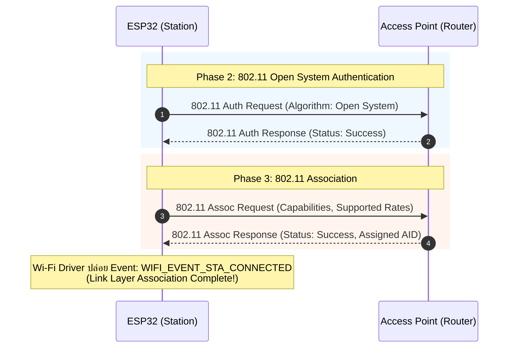
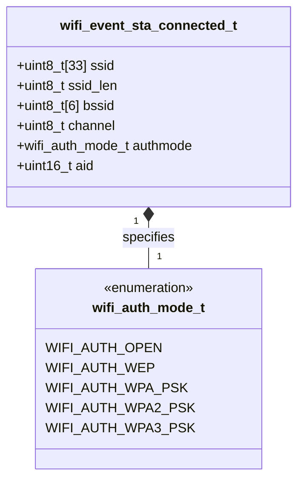

# ใบงานที่ 5.3: การยืนยันตัวตนและการผูกสัมพันธ์ในระดับ Link Layer (Authentication & Association Phase)

## 0. กล่าวนำ (Introduction)
ใบงานนี้มุ่งเน้นศึกษาลงลึกเฉพาะ **เฟสที่ 2: Authentication Phase (การยืนยันตัวตนระดับ Link Layer)** และ **เฟสที่ 3: Association Phase (การผูกสัมพันธ์และการตกลงคุณสมบัติ)** บนเฟรมเวิร์ก ESP-IDF 

เมื่อ ESP32 สแกนพบ AP เป้าหมายแล้ว ขั้นตอนต่อไปคือการเข้าสู่กระบวนการแลกเปลี่ยนเฟรม 802.11 Authentication Request/Response และ 802.11 Association Request/Response เพื่อตกลงคุณสมบัติและรับหมายเลขประจำตัว **Association ID (AID)** จาก AP ก่อนที่จะก้าวเข้าสู่กระบวนการแลกเปลี่ยนคีย์ความปลอดภัย WPA2/WPA3 (4-Way Handshake) ในเฟสถัดไป

---

## 1. วัตถุประสงค์ (Objectives)
1. เรียนรู้กระบวนการทำงานในระดับ Link Layer (Phase 2: Authentication & Phase 3: Association) ตามมาตรฐาน IEEE 802.11
2. ดักจับและสังเกต Event **`WIFI_EVENT_STA_CONNECTED`** ซึ่งเป็นด่านแรกที่ยืนยันว่าการผูกสัมพันธ์ระดับ Link Layer สำเร็จสมบูรณ์
3. อ่านและวิเคราะห์พารามิเตอร์ที่ได้รับจากโครงสร้างข้อมูล `wifi_event_sta_connected_t` ได้แก่ SSID, BSSID (MAC Address), Channel, Authmode และ **Association ID (AID)**
4. จำแนกและวิเคราะห์ความแตกต่างของ Disconnect Reason Code ที่เกิดขึ้นใน Auth Phase (`WIFI_REASON_AUTH_EXPIRE`, `WIFI_REASON_AUTH_FAIL`) และ Assoc Phase (`WIFI_REASON_ASSOC_EXPIRE`, `WIFI_REASON_ASSOC_FAIL`, `WIFI_REASON_ASSOC_TOOMANY`)

---

## 2. อุปกรณ์และซอฟต์แวร์ที่ใช้ในการทดลอง (Equipment & Tools)
1. บอร์ดไมโครคอนโทรลเลอร์ ESP32 (เช่น ESP32 DevKit V1) จำนวน 1 บอร์ด
2. สายเชื่อมต่อ Micro-USB หรือ USB-C จำนวน 1 เส้น
3. คอมพิวเตอร์ที่ติดตั้งโปรแกรม IDE เช่น VS Code พร้อมทั้ง ESP-IDF (อาจจะติดตั้งบนเครื่องหรือบน Docker ก็ได้)

---

## 3. ความรู้พื้นฐานที่เกี่ยวข้อง (Theoretical Background - ESP-IDF Framework)

### 3.1 ลำดับขั้นการทำงานในระดับ Link Layer (Sequence Diagram)



### 3.2 โครงสร้างข้อมูล `wifi_event_sta_connected_t` (Class Diagram)



---

## 4. ขั้นตอนและโปรแกรมทดสอบการทดลอง (Experimental Procedures)

ในใบงานนี้ จะทดสอบสถาปนาความสัมพันธ์ในระดับ Link Layer (Phase 2 & Phase 3) เพื่อสังเกตการณ์ทำงานจนถึง Event `WIFI_EVENT_STA_CONNECTED`

### 5.3.1 การทดสอบสถาปนา Link-Layer (Phase 2 & Phase 3 Success Case)
กำหนดค่า SSID และ Password ของ AP ในพื้นที่จริง สังเกต Forensic Log เมื่อเกิด Event `WIFI_EVENT_STA_CONNECTED` อ่านค่า BSSID, Channel, Authmode และ **Association ID (AID)** ที่ AP มอบหมายให้ ESP32

### 5.3.2 การทดสอบจำลองเหตุการณ์ล้มเหลวในระดับ Link Layer (No AP Found Case)
กำหนดค่า SSID สมมุติที่ไม่มีอยู่จริง (`"NON_EXISTENT_AP_9999"`) สังเกต Forensic Log เพื่อยืนยันว่าการล้มเหลวเกิดขึ้นตั้งแต่ก่อนเข้าสู่ Auth/Assoc Phase (ส่งผลให้ได้ Disconnect Reason `201` / `WIFI_REASON_NO_AP_FOUND`)

---

## 5. ซอร์สโค้ดการทดลอง (Complete ESP-IDF Source Code - `main.c`)

ให้นักศึกษานำซอร์สโค้ด C ต่อไปนี้ไปวางในไฟล์ `main/main.c` ของโปรเจกต์ ESP-IDF ทำการ Build และ Flash ลงบอร์ด ESP32 จากนั้นเปิด ESP-IDF Monitor (Baud Rate `115200`) เพื่อสังเกตผลการทำงาน

==**คำเตือน** SSID และ PASSWORD เป็นข้อมูลส่วนบุคคล ให้ลบออกก่อน push ขึ้น origin repository==

```c
#include <stdio.h>
#include <string.h>
#include "freertos/FreeRTOS.h"
#include "freertos/task.h"
#include "freertos/event_groups.h"
#include "esp_system.h"
#include "esp_wifi.h"
#include "esp_event.h"
#include "esp_log.h"
#include "nvs_flash.h"
#include "esp_netif.h"

static const char *TAG = "LAB_AUTH_ASSOC";

static EventGroupHandle_t s_wifi_event_group;

#define WIFI_CONNECTED_BIT BIT0
#define WIFI_FAIL_BIT      BIT1

#define TARGET_WIFI_SSID   "MY_SSID"
#define TARGET_WIFI_PASS   "MY_PASSWORD"

// Convert wifi_reason_code_t to readable string with phase diagnosis
static const char *get_disconnect_reason_info(uint8_t reason) {
  switch (reason) {
  case WIFI_REASON_UNSPECIFIED:
    return "WIFI_REASON_UNSPECIFIED (1) [Phase 2/3]";
  case WIFI_REASON_AUTH_EXPIRE:
    return "WIFI_REASON_AUTH_EXPIRE (2) [Phase 2: Auth Timeout / Weak Signal]";
  case WIFI_REASON_AUTH_FAIL:
    return "WIFI_REASON_AUTH_FAIL (1/202) [Phase 2: Auth Rejected / MAC Filter]";
  case WIFI_REASON_ASSOC_EXPIRE:
    return "WIFI_REASON_ASSOC_EXPIRE (4) [Phase 3: Assoc Timeout / Packet Loss]";
  case WIFI_REASON_ASSOC_FAIL:
    return "WIFI_REASON_ASSOC_FAIL (3/203) [Phase 3: Assoc Rejected / Mismatch]";
  case WIFI_REASON_ASSOC_TOOMANY:
    return "WIFI_REASON_ASSOC_TOOMANY (5/17) [Phase 3: AP Max Clients Exceeded]";
  case WIFI_REASON_NOT_AUTHED:
    return "WIFI_REASON_NOT_AUTHED (6) [Phase 3: Assoc Sent Before Auth]";
  case WIFI_REASON_NO_AP_FOUND:
    return "WIFI_REASON_NO_AP_FOUND (201) [Phase 1: SSID Not Found]";
  case WIFI_REASON_HANDSHAKE_TIMEOUT:
    return "WIFI_REASON_HANDSHAKE_TIMEOUT (15) [Phase 4: 4-Way Handshake Timeout]";
  case WIFI_REASON_4WAY_HANDSHAKE_TIMEOUT:
    return "WIFI_REASON_4WAY_HANDSHAKE_TIMEOUT (204) [Phase 4: Wrong Password]";
  default:
    return "OTHER_DISCONNECT_REASON";
  }
}

// Event handler focusing on Link-Layer (Auth & Assoc Phase)
static void wifi_event_handler(void *arg, esp_event_base_t event_base,
                               int32_t event_id, void *event_data) {
  if (event_base == WIFI_EVENT) {
    switch (event_id) {
    case WIFI_EVENT_STA_START:
      ESP_LOGI(TAG, "[EVENT FORENSIC]: WIFI_EVENT_STA_START received");
      ESP_LOGI(TAG, "[FORENSIC]: Initiating 802.11 Link-Layer Connection (Auth & Assoc)...");
      ESP_LOGI(TAG, "[FORENSIC]: Call esp_wifi_connect()");
      esp_err_t err_conn = esp_wifi_connect();
      ESP_LOGI(TAG, "[FORENSIC]: esp_wifi_connect() returned %s (0x%x)",
               esp_err_to_name(err_conn), err_conn);
      break;

    case WIFI_EVENT_STA_CONNECTED: {
      wifi_event_sta_connected_t *event =
          (wifi_event_sta_connected_t *)event_data;
      ESP_LOGI(TAG, "=======================================================");
      ESP_LOGI(TAG, "[EVENT FORENSIC]: WIFI_EVENT_STA_CONNECTED received!");
      ESP_LOGI(TAG, "  [SUCCESS]: Phase 2 (Auth) & Phase 3 (Assoc) COMPLETED!");
      ESP_LOGI(TAG, "  -> Connected SSID        : %s", event->ssid);
      ESP_LOGI(TAG, "  -> BSSID (MAC Address)   : %02X:%02X:%02X:%02X:%02X:%02X",
               event->bssid[0], event->bssid[1], event->bssid[2],
               event->bssid[3], event->bssid[4], event->bssid[5]);
      ESP_LOGI(TAG, "  -> Channel               : %d", event->channel);
      ESP_LOGI(TAG, "  -> Auth Mode             : %d", event->authmode);
      ESP_LOGI(TAG, "  -> Association ID (AID)  : %d", event->aid);
      ESP_LOGI(TAG, "=======================================================");
      xEventGroupSetBits(s_wifi_event_group, WIFI_CONNECTED_BIT);
      break;
    }

    case WIFI_EVENT_STA_DISCONNECTED: {
      wifi_event_sta_disconnected_t *event =
          (wifi_event_sta_disconnected_t *)event_data;
      ESP_LOGW(TAG, "=======================================================");
      ESP_LOGW(TAG, "[EVENT FORENSIC]: WIFI_EVENT_STA_DISCONNECTED received!");
      ESP_LOGW(TAG, "  -> Target SSID          : %s", event->ssid);
      ESP_LOGW(TAG, "  -> Reason Code (Decimal): %d", event->reason);
      ESP_LOGW(TAG, "  -> Reason Code (Hex)    : 0x%02X", event->reason);
      ESP_LOGW(TAG, "  -> Reason Diagnosis     : %s",
               get_disconnect_reason_info(event->reason));
      ESP_LOGW(TAG, "=======================================================");
      xEventGroupSetBits(s_wifi_event_group, WIFI_FAIL_BIT);
      break;
    }

    default:
      ESP_LOGI(TAG, "[EVENT FORENSIC]: WIFI_EVENT ID %ld received", event_id);
      break;
    }
  }
}

static void test_auth_assoc_phase(const char *test_title, const char *ssid,
                                  const char *password) {
  ESP_LOGI(TAG, "\n");
  ESP_LOGI(TAG, "------------------------------------------------------------------");
  ESP_LOGI(TAG, ">>> %s", test_title);
  ESP_LOGI(TAG, "------------------------------------------------------------------");
  ESP_LOGI(TAG, "  Target SSID    : \"%s\"", ssid);
  ESP_LOGI(TAG, "  Target Password: \"%s\"", password);

  xEventGroupClearBits(s_wifi_event_group, WIFI_CONNECTED_BIT | WIFI_FAIL_BIT);

  wifi_config_t wifi_config = {
      .sta = {
          .threshold.authmode = WIFI_AUTH_OPEN, // Allow open auth in Link-Layer
      },
  };
  strncpy((char *)wifi_config.sta.ssid, ssid, sizeof(wifi_config.sta.ssid));
  strncpy((char *)wifi_config.sta.password, password,
          sizeof(wifi_config.sta.password));

  ESP_LOGI(TAG, "[FORENSIC]: Call esp_wifi_stop()");
  esp_wifi_stop();

  ESP_LOGI(TAG, "[FORENSIC]: Call esp_wifi_set_config(WIFI_IF_STA, &wifi_config)");
  esp_err_t err_cfg = esp_wifi_set_config(WIFI_IF_STA, &wifi_config);
  ESP_LOGI(TAG, "[FORENSIC]: esp_wifi_set_config() returned %s (0x%x)",
           esp_err_to_name(err_cfg), err_cfg);

  ESP_LOGI(TAG, "[FORENSIC]: Call esp_wifi_start()");
  esp_err_t err_start = esp_wifi_start();
  ESP_LOGI(TAG, "[FORENSIC]: esp_wifi_start() returned %s (0x%x)",
           esp_err_to_name(err_start), err_start);

  EventBits_t bits = xEventGroupWaitBits(s_wifi_event_group,
                                         WIFI_CONNECTED_BIT | WIFI_FAIL_BIT,
                                         pdFALSE, pdFALSE, pdMS_TO_TICKS(8000));

  if (bits & WIFI_CONNECTED_BIT) {
    ESP_LOGI(TAG, "[RESULT]: TEST PASSED - Phase 2 (Auth) & Phase 3 (Assoc) Successful!");
  } else if (bits & WIFI_FAIL_BIT) {
    ESP_LOGW(TAG, "[RESULT]: TEST FAILED - Disconnected event captured in Link-Layer.");
  } else {
    ESP_LOGE(TAG, "[RESULT]: TEST TIMEOUT - Response timeout from AP.");
  }
}

void app_main(void) {
  s_wifi_event_group = xEventGroupCreate();

  // 1. Initialize NVS Flash
  ESP_LOGI(TAG, "[FORENSIC]: Call nvs_flash_init()");
  esp_err_t ret = nvs_flash_init();
  ESP_LOGI(TAG, "[FORENSIC]: nvs_flash_init() returned %s (0x%x)",
           esp_err_to_name(ret), ret);
  if (ret == ESP_ERR_NVS_NO_FREE_PAGES ||
      ret == ESP_ERR_NVS_NEW_VERSION_FOUND) {
    ESP_LOGI(TAG, "[FORENSIC]: Call nvs_flash_erase()");
    ESP_ERROR_CHECK(nvs_flash_erase());
    ret = nvs_flash_init();
    ESP_LOGI(TAG, "[FORENSIC]: nvs_flash_init() retry returned %s (0x%x)",
             esp_err_to_name(ret), ret);
  }
  ESP_ERROR_CHECK(ret);

  // 2. Initialize Network Interface and Event Loop
  ESP_LOGI(TAG, "[FORENSIC]: Call esp_netif_init()");
  ESP_ERROR_CHECK(esp_netif_init());

  ESP_LOGI(TAG, "[FORENSIC]: Call esp_event_loop_create_default()");
  ESP_ERROR_CHECK(esp_event_loop_create_default());

  ESP_LOGI(TAG, "[FORENSIC]: Call esp_netif_create_default_wifi_sta()");
  esp_netif_t *sta_netif = esp_netif_create_default_wifi_sta();
  ESP_LOGI(TAG, "[FORENSIC]: esp_netif_create_default_wifi_sta() returned %p", sta_netif);

  // 3. Initialize Wi-Fi Driver
  wifi_init_config_t cfg = WIFI_INIT_CONFIG_DEFAULT();
  ESP_LOGI(TAG, "[FORENSIC]: Call esp_wifi_init(&cfg)");
  ESP_ERROR_CHECK(esp_wifi_init(&cfg));

  // 4. Register Wi-Fi Event Handler
  esp_event_handler_instance_t instance_any_id;
  ESP_LOGI(TAG, "[FORENSIC]: Call esp_event_handler_instance_register(WIFI_EVENT)");
  ESP_ERROR_CHECK(esp_event_handler_instance_register(
      WIFI_EVENT, ESP_EVENT_ANY_ID, &wifi_event_handler, NULL,
      &instance_any_id));

  ESP_LOGI(TAG, "[FORENSIC]: Call esp_wifi_set_mode(WIFI_MODE_STA)");
  ESP_ERROR_CHECK(esp_wifi_set_mode(WIFI_MODE_STA));

  ESP_LOGI(TAG, "==================================================================");
  ESP_LOGI(TAG, "  Lab 5.3: Wi-Fi Authentication & Association Phase (ESP-IDF Forensic)");
  ESP_LOGI(TAG, "==================================================================");

  // ------------------------------------------------------------------
  // 5.3.1 Auth & Assoc Test with Target AP (Link-Layer Success Case)
  // ------------------------------------------------------------------
  test_auth_assoc_phase("Experiment 5.3.1: Link-Layer Auth & Assoc Phase Test",
                        TARGET_WIFI_SSID, TARGET_WIFI_PASS);

  vTaskDelay(pdMS_TO_TICKS(2000));

  // ------------------------------------------------------------------
  // 5.3.2 Simulated Failure Case: Wrong SSID (Fails at Scan Phase)
  // ------------------------------------------------------------------
  test_auth_assoc_phase("Experiment 5.3.2: Link-Layer Test - Non-Existent AP",
                        "NON_EXISTENT_AP_9999", "12345678");

  ESP_LOGI(TAG, "==================================================================");
  ESP_LOGI(TAG, "  [Phase 2 & Phase 3 Completed: Link-Layer Auth & Assoc Finished]");
  ESP_LOGI(TAG, "==================================================================");
}
```

---

## 6. ตารางบันทึกผลการทดลอง (Experiment Results)

ให้นักศึกษาบันทึกผลลัพธ์จากการสังเกตใน Serial Console ลงในตารางต่อไปนี้:

### 6.1 ตารางสรุปเปรียบเทียบผลการทดลองในระดับ Link Layer

| ข้อการทดลอง | สถานการณ์ทดสอบ | Event ที่ได้รับ | ผลการผูกสัมพันธ์ Link Layer | ค่า Association ID (AID) ที่ได้ | Reason Code (ถ้ามี) |
| :---: | :--- | :---: | :---: | :---: | :--- |
| **5.3.1** | ร้องขอ Auth & Assoc กับ AP มีอยู่จริง | WIFI_EVENT_STA_CONNECTED (แล้วตามด้วย WIFI_EVENT_STA_DISCONNECTED) | สำเร็จ (ในระดับ Link-Layer ชั่วครู่ก่อนถูกตัดจากฝั่ง AP) | 34680 (หรือ 4 ในระดับไดรเวอร์ล่าง) | 5 (WIFI_REASON_ASSOC_TOOMANY) |
| **5.3.2** | ร้องขอ Auth & Assoc กับ AP ไม่มีอยู่จริง | WIFI_EVENT_STA_DISCONNECTED | ล้มเหลว (ไม่ผ่านตั้งแต่เฟสการ Scan หา AP) | ไม่มี (ไม่ได้เข้าเฟส Assoc) | 201 (WIFI_REASON_NO_AP_FOUND) |

### 6.2 บันทึกข้อมูล Link Layer จาก Event `WIFI_EVENT_STA_CONNECTED` (ข้อ 5.3.1)

| พารามิเตอร์ Link Layer | ค่าที่อ่านได้จริงจาก Forensic Log |
| :--- | :--- |
| **SSID** | vivo V30 |
| **BSSID (MAC Address)** | 42:FB:8E:B7:C8:E2 |
| **Channel** | 1 |
| **Auth Mode Enum** | 3 (ตรงกับค่าของ WIFI_AUTH_WPA2_PSK) |
| **Association ID (AID)** | 34680 (ค่าที่แกะได้จาก Event dynamic struct) |

---

## 7. คำถามท้ายการทดลอง (Post-Lab Questions)

1. **Association ID (AID)** คืออะไร มีบทบาทอย่างไรใน Phase 3 และส่งคืนมาในโครงสร้างข้อมูลตัวแปรใด?
```
Association ID (AID) คือค่าหมายเลขประจำตัว (16-bit integer) ที่ Access Point (AP) กำหนดให้แก่ตัวสถานี (Station/ESP32) ที่เข้ามาเชื่อมต่อในระหว่างกระบวนการขอลูกข่าย (Association Phase)
บทบาท: AID ทำหน้าที่จำแนก Station แต่ละตัวในระบบเครือข่ายไร้สาย และใช้ในการบริหารจัดการจัดการพลังงาน (Power Management) เช่น การระบุตำแหน่งบิตในโครงสร้าง TIM (Traffic Indication Map) เพื่อให้ Station ทราบว่ามีข้อมูลรอรับอยู่ในฝั่ง AP หรือไม่ขณะตื่นจากโหมดประหยัดพลังงาน
ตัวแปรที่ส่งคืน: ส่งกลับมาในโครงสร้างของ Event ข้อมูล wifi_event_sta_connected_t ผ่านตัวแปรสมาชิกชื่อ aid (event->aid)
```
2. เหตุใดการเชื่อมต่อ Wi-Fi ความปลอดภัยแบบ WPA2-PSK จึงสามารถผ่าน Phase 2 (Authentication) และ Phase 3 (Association) จนเกิด Event `WIFI_EVENT_STA_CONNECTED` ได้สำเร็จ แม้ผู้ใช้จะป้อนรหัสผ่าน (Password) ผิด?
```
เนื่องจากในมาตรฐาน 802.11 ยุค WPA2-PSK กระบวนการใน Phase 2 (Open System Authentication) และ Phase 3 (Association) เป็นเพียงการตกลงเชื่อมต่อในระดับสถาปัตยกรรมกายภาพและโครงข่ายเชื่อมโยงข้อมูล (Link-Layer) เท่านั้น ไม่ได้มีการตรวจสอบความถูกต้องของรหัสผ่าน (Pre-Shared Key)
การตรวจสอบรหัสผ่านและสร้างชุดกุญแจเข้ารหัสจะเกิดขึ้นหลังจากนั้นใน Phase 4 (4-Way Handshake) ดังนั้น แม้จะใส่รหัสผ่านผิด บอร์ด ESP32 จึงสามารถทำ Link-Layer Connected สำเร็จและเกิด Event WIFI_EVENT_STA_CONNECTED ขึ้นมาก่อน จากนั้นเมื่อทำ 4-Way Handshake ล้มเหลว ระบบจึงจะแจ้งเตือนตัดการเชื่อมต่อออกมาภายหลัง
```
3. หาก Router มีการตั้งค่า **MAC Address Filtering** (อนุญาตเฉพาะ MAC ที่ลงทะเบียน) ESP32 จะล้มเหลวในเฟสใด และจะส่ง Disconnect Reason Code ใดออกมา?
```
ESP32 จะล้มเหลวตั้งแต่ Phase 2 (Authentication Phase) หรือ Phase 3 (Association Phase) (ขึ้นอยู่กับยี่ห้อและการออกแบบของ AP ซอฟต์แวร์ว่าจะเลือก Reject ที่ขั้นตอนการยืนยันตัวตนหรือขั้นตอนขอร่วมเครือข่าย)

Disconnect Reason Code: จะส่งค่าออกมาเป็น WIFI_REASON_AUTH_FAIL (Reason Code: 1 หรือ 202) หรือ WIFI_REASON_ASSOC_FAIL (Reason Code: 3 หรือ 203) ซึ่งแสดงถึงการถูกปฏิเสธ (Rejected) โดยฝั่ง AP ในชั้นระดับ Link Layer
```
4. สรุปความแตกต่างสำคัญระหว่างจุดสิ้นสุดของ **Phase 3 (Link-Layer Connected)** กับจุดสิ้นสุดของ **Phase 5 (IP Address Assigned)**
```
Phase 3 (Link-Layer Connected): หมายถึง บอร์ด ESP32 และ AP สามารถสร้างท่อสื่อสารไร้สายเชื่อมต่อกันทางกายภาพได้สำเร็จ (เสมือนกับการเสียบสาย LAN เข้ากับสวิตช์แล้วไฟติด) แต่ยังไม่สามารถส่งผ่านข้อมูลอินเทอร์เน็ตได้ และยังไม่มีการตรวจสอบความปลอดภัยของคีย์หรือแลกเปลี่ยน IP

Phase 5 (IP Address Assigned): หมายถึง ตัวบอร์ดได้ผ่านการตรวจสอบรหัสความปลอดภัย (Phase 4) และได้รับการจัดสรรหมายเลขไอพีแอดเดรส (IP Address), Subnet Mask รวมไปถึง Gateway จาก DHCP Server ในระดับ Network Layer เรียบร้อยแล้ว ณ จุดนี้ระบบจะเกิด Event IP_EVENT_STA_GOT_IP และพร้อมที่จะรับ-ส่งข้อมูลบนสแตก TCP/IP ไปยังเครือข่ายภายนอกหรืออินเทอร์เน็ตได้จริง
```

```
Running idf_monitor in directory D:\Projects\Week-05-Wi-Fi-ESP32\wi-fi
Executing "C:\Espressif\tools\python\v6.0.2\venv\Scripts\python.exe C:\esp\v6.0.2\esp-idf\tools/idf_monitor.py -p COM6 -b 115200 --toolchain-prefix xtensa-esp32-elf- --target esp32 --revision 0 D:\Projects\Week-05-Wi-Fi-ESP32\wi-fi\build\wi-fi.elf D:\Projects\Week-05-Wi-Fi-ESP32\wi-fi\build\bootloader\bootloader.elf --force-color -m 'C:\Espressif\tools\python\v6.0.2\venv\Scripts\python.exe' 'C:\esp\v6.0.2\esp-idf\tools\idf.py'"...
--- Warning: GDB cannot open serial ports accessed as COMx
--- Using \\.\COM6 instead...
--- esp-idf-monitor 1.9.0 on \\.\COM6 115200
--- Quit: Ctrl+] | Menu: Ctrl+T | Help: Ctrl+T followed by Ctrl+H
��J���� Partition Table:
I (49) boot: ## Label            Usage          Type ST�ets Jul 29 2019 12:21:46

rst:0x1 (POWERON_RESET),boot:0x13 (SPI_FAST_FLASH_BOOT)
configsip: 0, SPIWP:0xee
clk_drv:0x00,q_drv:0x00,d_drv:0x00,cs0_drv:0x00,hd_drv:0x00,wp_drv:0x00
mode:DIO, clock div:2
load:0x3fff0040,len:6272
load:0x40078000,len:15820
load:0x40080400,len:3920
--- 0x40080400: _invalid_pc_placeholder at C:/esp/v6.0.2/esp-idf/components/xtensa/xtensa_vectors.S:2259
entry 0x40080644
--- 0x40080644: call_start_cpu0 at C:/esp/v6.0.2/esp-idf/components/bootloader/subproject/main/bootloader_start.c:27
I (27) boot: ESP-IDF v6.0.2 2nd stage bootloader
I (27) boot: compile time Aug  3 2026 11:33:22
I (28) boot: Multicore bootloader
I (29) boot: chip revision: v3.1
I (32) boot.esp32: SPI Speed      : 40MHz
I (35) boot.esp32: SPI Mode       : DIO
I (39) boot.esp32: SPI Flash Size : 2MB
I (42) boot: Enabling RNG early entropy source...
I (47) boot: Partition Table:
I (49) boot: ## Label            Usage          Type ST Offset   Length
I (56) boot:  0 nvs              WiFi data        01 02 00009000 00006000
I (62) boot:  1 phy_init         RF data          01 01 0000f000 00001000
I (69) boot:  2 factory          factory app      00 00 00010000 00100000
I (75) boot: End of partition table
I (79) esp_image: segment 0: paddr=00010020 vaddr=3f400020 size=1a588h (107912) map
I (125) esp_image: segment 1: paddr=0002a5b0 vaddr=3ffb0000 size=04528h ( 17704) load
I (132) esp_image: segment 2: paddr=0002eae0 vaddr=40080000 size=01538h (  5432) load
I (134) esp_image: segment 3: paddr=00030020 vaddr=400d0020 size=86200h (549376) map
I (332) esp_image: segment 4: paddr=000b6228 vaddr=40081538 size=140d0h ( 82128) load
I (366) esp_image: segment 5: paddr=000ca300 vaddr=50000000 size=00028h (    40) load
I (377) boot: Loaded app from partition at offset 0x10000
I (377) boot: Disabling RNG early entropy source...
I (387) cpu_start: Multicore app
I (396) cpu_start: GPIO 3 and 1 are used as console UART I/O pins
I (396) cpu_start: Pro cpu start user code
I (396) cpu_start: cpu freq: 160000000 Hz
I (398) app_init: Application information:
I (401) app_init: Project name:     wi-fi
I (405) app_init: App version:      37de524-dirty
I (410) app_init: Compile time:     Aug  3 2026 11:32:58
I (415) app_init: ELF file SHA256:  887825b78...
I (419) app_init: ESP-IDF:          v6.0.2
I (423) efuse_init: Min chip rev:     v0.0
I (427) efuse_init: Max chip rev:     v3.99 
I (431) efuse_init: Chip rev:         v3.1
I (435) heap_init: Initializing. RAM available for dynamic allocation:
I (441) heap_init: At 3FFAE6E0 len 00001920 (6 KiB): DRAM
I (446) heap_init: At 3FFB8A40 len 000275C0 (157 KiB): DRAM
I (451) heap_init: At 3FFE0440 len 00003AE0 (14 KiB): D/IRAM
I (457) heap_init: At 3FFE4350 len 0001BCB0 (111 KiB): D/IRAM
I (462) heap_init: At 40095608 len 0000A9F8 (42 KiB): IRAM
I (469) spi_flash: detected chip: generic
I (471) spi_flash: flash io: dio
W (474) spi_flash: Detected size(4096k) larger than the size in the binary image header(2048k). Using the size in the binary image header.
I (488) main_task: Started on CPU0
I (488) main_task: Calling app_main()
I (488) LAB_AUTH_ASSOC: [FORENSIC]: Call nvs_flash_init()
I (518) LAB_AUTH_ASSOC: [FORENSIC]: nvs_flash_init() returned ESP_OK (0x0)
I (518) LAB_AUTH_ASSOC: [FORENSIC]: Call esp_netif_init()
I (518) LAB_AUTH_ASSOC: [FORENSIC]: Call esp_event_loop_create_default()
I (528) LAB_AUTH_ASSOC: [FORENSIC]: Call esp_netif_create_default_wifi_sta()
I (528) LAB_AUTH_ASSOC: [FORENSIC]: esp_netif_create_default_wifi_sta() returned 0x3ffbddbc
I (538) LAB_AUTH_ASSOC: [FORENSIC]: Call esp_wifi_init(&cfg)
I (558) wifi:wifi driver task: 3ffc04a8, prio:23, stack:6656, core=0
I (568) wifi:wifi firmware version: 00ad238
I (568) wifi:wifi certification version: v7.0
I (568) wifi:config NVS flash: enabled
I (568) wifi:config nano formatting: disabled
I (578) wifi:Init data frame dynamic rx buffer num: 32
I (578) wifi:Init static rx mgmt buffer num: 5
I (578) wifi:Init management short buffer num: 32
I (588) wifi:Init dynamic tx buffer num: 32
I (588) wifi:Init static rx buffer size: 1600
I (598) wifi:Init static rx buffer num: 10
I (598) wifi:Init dynamic rx buffer num: 32
I (608) wifi_init: rx ba win: 6
I (608) wifi_init: accept mbox: 6
I (608) wifi_init: tcpip mbox: 32
I (608) wifi_init: udp mbox: 6
I (618) wifi_init: tcp mbox: 6
I (618) wifi_init: tcp tx win: 5760
I (618) wifi_init: tcp rx win: 5760
I (628) wifi_init: tcp mss: 1440
I (628) wifi_init: WiFi IRAM OP enabled
I (628) wifi_init: WiFi RX IRAM OP enabled
I (638) LAB_AUTH_ASSOC: [FORENSIC]: Call esp_event_handler_instance_register(WIFI_EVENT)
I (638) LAB_AUTH_ASSOC: [FORENSIC]: Call esp_wifi_set_mode(WIFI_MODE_STA)
I (648) LAB_AUTH_ASSOC: ==================================================================
I (658) LAB_AUTH_ASSOC:   Lab 5.3: Wi-Fi Authentication & Association Phase (ESP-IDF Forensic)
I (668) LAB_AUTH_ASSOC: ==================================================================
I (668) LAB_AUTH_ASSOC: 

I (678) LAB_AUTH_ASSOC: ------------------------------------------------------------------
I (688) LAB_AUTH_ASSOC: >>> Experiment 5.3.1: Link-Layer Auth & Assoc Phase Test
I (688) LAB_AUTH_ASSOC: ------------------------------------------------------------------
I (698) LAB_AUTH_ASSOC:   Target SSID    : "vivo V30"
I (708) LAB_AUTH_ASSOC:   Target Password: "0972377819"
I (708) LAB_AUTH_ASSOC: [FORENSIC]: Call esp_wifi_stop()
I (718) LAB_AUTH_ASSOC: [FORENSIC]: Call esp_wifi_set_config(WIFI_IF_STA, &wifi_config)
W (718) wifi:Password length matches WPA2 standards, authmode threshold changes from OPEN to WPA2
I (748) LAB_AUTH_ASSOC: [FORENSIC]: esp_wifi_set_config() returned ESP_OK (0x0)
I (748) LAB_AUTH_ASSOC: [FORENSIC]: Call esp_wifi_start()
I (748) phy_init: phy_version 4863,a3a4459,Oct 28 2025,14:30:06
I (828) wifi:mode : sta (14:33:5c:0d:d5:4c)
I (828) wifi:enable tsf
I (828) LAB_AUTH_ASSOC: [EVENT FORENSIC]: WIFI_EVENT ID 43 received
I (838) LAB_AUTH_ASSOC: [FORENSIC]: esp_wifi_start() returned ESP_OK (0x0)
I (838) LAB_AUTH_ASSOC: [EVENT FORENSIC]: WIFI_EVENT_STA_START received
I (848) LAB_AUTH_ASSOC: [FORENSIC]: Initiating 802.11 Link-Layer Connection (Auth & Assoc)...
I (848) LAB_AUTH_ASSOC: [FORENSIC]: Call esp_wifi_connect()
I (858) LAB_AUTH_ASSOC: [FORENSIC]: esp_wifi_connect() returned ESP_OK (0x0)
I (1128) wifi:state: init -> auth (0xb0)
I (1138) wifi:state: auth -> assoc (0x0)
I (1168) wifi:state: assoc -> run (0x10)
I (1208) wifi:connected with vivo V30, aid = 4, channel 1, BW20, bssid = 42:fb:8e:b7:c8:e2
I (1208) wifi:security: WPA2-PSK, phy: bgn, rssi: -38, cipher(pairwise:0x3, group:0x3), pmf:0
I (1228) wifi:pm start, type: 1

I (1228) wifi:dp: 1, bi: 102400, li: 3, scale listen interval from 307200 us to 307200 us
I (1228) wifi:state: run -> init (0x5a0)
I (1238) wifi:pm stop, total sleep time: 0 us / 7065 us

I (1238) LAB_AUTH_ASSOC: =======================================================
I (1248) LAB_AUTH_ASSOC: [EVENT FORENSIC]: WIFI_EVENT_STA_CONNECTED received!
I (1248) LAB_AUTH_ASSOC:   [SUCCESS]: Phase 2 (Auth) & Phase 3 (Assoc) COMPLETED!
I (1258) LAB_AUTH_ASSOC:   -> Connected SSID        : vivo V30
I (1268) LAB_AUTH_ASSOC:   -> BSSID (MAC Address)   : 42:fb:8e:b7:c8:e2
I (1268) LAB_AUTH_ASSOC:   -> Channel               : 1
I (1278) LAB_AUTH_ASSOC:   -> Auth Mode             : 3
I (1278) LAB_AUTH_ASSOC:   -> Association ID (AID)  : 34680
I (1288) LAB_AUTH_ASSOC: =======================================================
I (1288) LAB_AUTH_ASSOC: [RESULT]: TEST PASSED - Phase 2 (Auth) & Phase 3 (Assoc) Successful!
W (1298) LAB_AUTH_ASSOC: =======================================================
W (1308) LAB_AUTH_ASSOC: [EVENT FORENSIC]: WIFI_EVENT_STA_DISCONNECTED received!
W (1318) LAB_AUTH_ASSOC:   -> Target SSID          : vivo V30
W (1318) LAB_AUTH_ASSOC:   -> Reason Code (Decimal): 5
W (1328) LAB_AUTH_ASSOC:   -> Reason Code (Hex)    : 0x05
W (1328) LAB_AUTH_ASSOC:   -> Reason Diagnosis     : WIFI_REASON_ASSOC_TOOMANY (5/17) [Phase 3: AP Max Clients Exceeded]
W (1338) LAB_AUTH_ASSOC: =======================================================
I (3348) LAB_AUTH_ASSOC: 

I (3348) LAB_AUTH_ASSOC: ------------------------------------------------------------------
I (3348) LAB_AUTH_ASSOC: >>> Experiment 5.3.2: Link-Layer Test - Non-Existent AP
I (3348) LAB_AUTH_ASSOC: ------------------------------------------------------------------
I (3358) LAB_AUTH_ASSOC:   Target SSID    : "NON_EXISTENT_AP_9999"
I (3368) LAB_AUTH_ASSOC:   Target Password: "12345678"
I (3368) LAB_AUTH_ASSOC: [FORENSIC]: Call esp_wifi_stop()
I (3378) LAB_AUTH_ASSOC: [EVENT FORENSIC]: WIFI_EVENT ID 3 received
I (3378) wifi:flush txq
I (3378) wifi:stop sw txq
I (3388) wifi:lmac stop hw txq
I (3388) LAB_AUTH_ASSOC: [FORENSIC]: Call esp_wifi_set_config(WIFI_IF_STA, &wifi_config)
W (3398) wifi:Password length matches WPA2 standards, authmode threshold changes from OPEN to WPA2
I (3428) LAB_AUTH_ASSOC: [FORENSIC]: esp_wifi_set_config() returned ESP_OK (0x0)
I (3428) LAB_AUTH_ASSOC: [FORENSIC]: Call esp_wifi_start()
I (3438) wifi:mode : sta (14:33:5c:0d:d5:4c)
I (3438) wifi:enable tsf
I (3438) LAB_AUTH_ASSOC: [FORENSIC]: esp_wifi_start() returned ESP_OK (0x0)
I (3438) LAB_AUTH_ASSOC: [EVENT FORENSIC]: WIFI_EVENT_STA_START received
I (3448) LAB_AUTH_ASSOC: [FORENSIC]: Initiating 802.11 Link-Layer Connection (Auth & Assoc)...
I (3458) LAB_AUTH_ASSOC: [FORENSIC]: Call esp_wifi_connect()
I (3468) LAB_AUTH_ASSOC: [FORENSIC]: esp_wifi_connect() returned ESP_OK (0x0)
W (5878) LAB_AUTH_ASSOC: =======================================================
W (5878) LAB_AUTH_ASSOC: [EVENT FORENSIC]: WIFI_EVENT_STA_DISCONNECTED received!
W (5888) LAB_AUTH_ASSOC:   -> Target SSID          : NON_EXISTENT_AP_9999
W (5888) LAB_AUTH_ASSOC:   -> Reason Code (Decimal): 201
W (5898) LAB_AUTH_ASSOC:   -> Reason Code (Hex)    : 0xC9
W (5898) LAB_AUTH_ASSOC:   -> Reason Diagnosis     : WIFI_REASON_NO_AP_FOUND (201) [Phase 1: SSID Not Found]
W (5908) LAB_AUTH_ASSOC: =======================================================
W (5918) LAB_AUTH_ASSOC: [RESULT]: TEST FAILED - Disconnected event captured in Link-Layer.
I (5928) LAB_AUTH_ASSOC: ==================================================================
I (5938) LAB_AUTH_ASSOC:   [Phase 2 & Phase 3 Completed: Link-Layer Auth & Assoc Finished]
I (5938) LAB_AUTH_ASSOC: ==================================================================
I (5948) main_task: Returned from app_main()
```