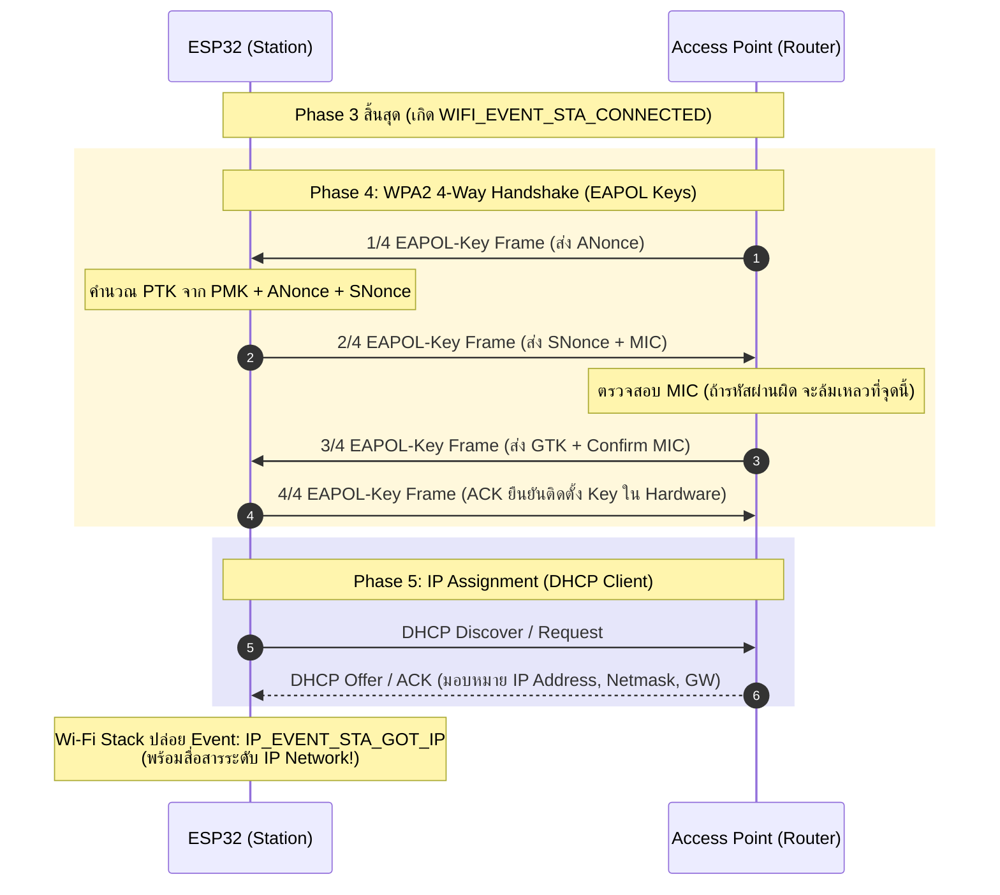
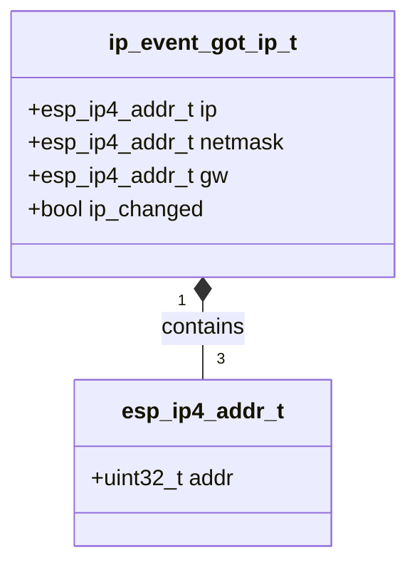

# ใบงานที่ 5.4: กระบวนการแลกเปลี่ยนคีย์ความปลอดภัยและการจัดสรรหมายเลข IP Address (4-Way Handshake & IP Assignment Phase)

## 0. กล่าวนำ (Introduction)
ใบงานนี้มุ่งเน้นศึกษาขั้นตอนสุดท้ายของการเชื่อมต่อ Wi-Fi นั่นคือ **เฟสที่ 4: Four-way Handshake Phase (การตกลงคีย์ความปลอดภัย WPA2/WPA3)** และ **เฟสที่ 5: IP Assignment Phase (การขอรับหมายเลข IP Address ผ่าน DHCP)** บนเฟรมเวิร์ก ESP-IDF

นักศึกษาจะได้ศึกษาถึงกลไกการแลกเปลี่ยนเฟรม **EAPOL-Key Frames (1/4 ถึง 4/4)** เพื่อพิสูจน์ทราบความถูกต้องของรหัสผ่าน (Pre-Shared Key - PSK) โดยไม่มีการส่งรหัสผ่านจริงผ่านคลื่นวิทยุ รวมถึงสังเกตการณ์ทำงานเมื่อพิมพ์รหัสผ่านผิด ซึ่งจะนำไปสู่ความล้มเหลวในการตรวจสอบค่า MIC (Message Integrity Code) และเกิด Disconnect Event ด้วย Reason Code `15` (`WIFI_REASON_HANDSHAKE_TIMEOUT`) หรือ `204` (`WIFI_REASON_4WAY_HANDSHAKE_TIMEOUT`)

---

## 1. วัตถุประสงค์ (Objectives)
1. เรียนรู้กลไกการแลกเปลี่ยนคีย์ความปลอดภัย WPA2 Personal (4-Way Handshake) ผ่านโปรโตคอล EAPOL
2. เข้าใจบทบาทของ PMK (Pairwise Master Key), ANonce, SNonce, PTK (Pairwise Transient Key) และ MIC (Message Integrity Code)
3. สังเกตและวิเคราะห์ลำดับการเกิด Event ระหว่าง **`WIFI_EVENT_STA_CONNECTED`** (สำเร็จในเฟส 3 Link-Layer) และ **`IP_EVENT_STA_GOT_IP`** (สำเร็จในเฟส 5 Network Layer)
4. อ่านโครงสร้างข้อมูล `ip_event_got_ip_t` เพื่อดึงค่า IP Address, Subnet Mask และ Gateway
5. ตรวจสอบความผิดปกติเมื่อพิมพ์รหัสผ่าน Wi-Fi ผิดผ่าน Disconnect Reason Code ในเฟสที่ 4

---

## 2. อุปกรณ์และซอฟต์แวร์ที่ใช้ในการทดลอง (Equipment & Tools)
1. บอร์ดไมโครคอนโทรลเลอร์ ESP32 (เช่น ESP32 DevKit V1) จำนวน 1 บอร์ด
2. สายเชื่อมต่อ Micro-USB หรือ USB-C จำนวน 1 เส้น
3. คอมพิวเตอร์ที่ติดตั้งโปรแกรม IDE เช่น VS Code พร้อมทั้ง ESP-IDF (อาจจะติดตั้งบนเครื่องหรือบน Docker ก็ได้)

---

## 3. ความรู้พื้นฐานที่เกี่ยวข้อง (Theoretical Background - ESP-IDF Framework)

### 3.1 ลำดับขั้นการแลกเปลี่ยนแพ็กเกจ 4-Way Handshake และ DHCP (Sequence Diagram)



### 3.2 โครงสร้างข้อมูล `ip_event_got_ip_t` (Class Diagram)



---

## 4. ขั้นตอนและโปรแกรมทดสอบการทดลอง (Experimental Procedures)

ในใบงานนี้ จะทำการทดสอบสถาปนาการเชื่อมต่อจนถึงขั้นตกลงคีย์เข้ารหัสและรับ IP Address ใน 2 สถานการณ์:

### 5.4.1 การเชื่อมต่อสำเร็จด้วย Password ที่ถูกต้อง (Success Case)
กำหนดค่า SSID และ Password ที่ถูกต้องตามความเป็นจริง สังเกต Forensic Log จากเฟส 3 (`WIFI_EVENT_STA_CONNECTED`) ไปสู่เฟส 4 (4-Way Handshake) และสิ้นสุดที่เฟส 5 (`IP_EVENT_STA_GOT_IP`) พร้อมบันทึกหมายเลข IP Address, Subnet Mask และ Gateway

### 5.4.2 การจำลองความล้มเหลวใน 4-Way Handshake เมื่อพิมพ์ Password ผิด (Handshake Failure Case)
กำหนดค่า SSID ถูกต้องแต่ระบุ Password ผิด (`"WRONG_PASSWORD_1234"`) สังเกต Forensic Log เพื่อยืนยันว่า ESP32 สามารถผ่านเฟส 2 และ 3 ได้ (`WIFI_EVENT_STA_CONNECTED`) แต่จะถูกตัดการเชื่อมต่อในเฟส 4 เนื่องจาก MIC ไม่ตรงกัน ส่งผลให้เกิด Disconnect Event ด้วย Reason Code `15` (`WIFI_REASON_HANDSHAKE_TIMEOUT`) หรือ `204` (`WIFI_REASON_4WAY_HANDSHAKE_TIMEOUT`)

---

## 5. ซอร์สโค้ดการทดลอง (Complete ESP-IDF Source Code - `main.c`)

ให้นักศึกษานำซอร์สโค้ด C ต่อไปนี้ไปวางในไฟล์ `main/main.c` ของโปรเจกต์ ESP-IDF ทำการ Build และ Flash ลงบอร์ด ESP32 จากนั้นเปิด ESP-IDF Monitor (Baud Rate `115200`) เพื่อสังเกตผลการทำงาน

```c
#include <stdio.h>
#include <string.h>
#include "freertos/FreeRTOS.h"
#include "freertos/task.h"
#include "freertos/event_groups.h"
#include "esp_system.h"
#include "esp_wifi.h"
#include "esp_event.h"
#include "esp_log.h"
#include "nvs_flash.h"
#include "esp_netif.h"

static const char *TAG = "LAB_HANDSHAKE_IP";

static EventGroupHandle_t s_wifi_event_group;

#define WIFI_CONNECTED_BIT BIT0
#define WIFI_FAIL_BIT      BIT1

#define TARGET_WIFI_SSID   "MY_SSID"
#define TARGET_WIFI_PASS   "MY_PASSWORD"

static const char *get_disconnect_reason_info(uint8_t reason) {
  switch (reason) {
  case WIFI_REASON_UNSPECIFIED:
    return "WIFI_REASON_UNSPECIFIED (1)";
  case WIFI_REASON_AUTH_EXPIRE:
    return "WIFI_REASON_AUTH_EXPIRE (2)";
  case WIFI_REASON_AUTH_FAIL:
    return "WIFI_REASON_AUTH_FAIL (1/202)";
  case WIFI_REASON_ASSOC_EXPIRE:
    return "WIFI_REASON_ASSOC_EXPIRE (4)";
  case WIFI_REASON_ASSOC_FAIL:
    return "WIFI_REASON_ASSOC_FAIL (3/203)";
  case WIFI_REASON_HANDSHAKE_TIMEOUT:
    return "WIFI_REASON_HANDSHAKE_TIMEOUT (15) [Phase 4: MIC mismatch / EAPOL timeout]";
  case WIFI_REASON_4WAY_HANDSHAKE_TIMEOUT:
    return "WIFI_REASON_4WAY_HANDSHAKE_TIMEOUT (204) [Phase 4: Wrong Password]";
  case WIFI_REASON_NO_AP_FOUND:
    return "WIFI_REASON_NO_AP_FOUND (201) [Phase 1: SSID Not Found]";
  case WIFI_REASON_BEACON_TIMEOUT:
    return "WIFI_REASON_BEACON_TIMEOUT (200)";
  default:
    return "OTHER_DISCONNECT_REASON";
  }
}

static void wifi_event_handler(void *arg, esp_event_base_t event_base,
                               int32_t event_id, void *event_data) {
  if (event_base == WIFI_EVENT) {
    switch (event_id) {
    case WIFI_EVENT_STA_START:
      ESP_LOGI(TAG, "[EVENT FORENSIC]: WIFI_EVENT_STA_START received");
      ESP_LOGI(TAG, "[FORENSIC]: Call esp_wifi_connect()");
      esp_err_t err_conn = esp_wifi_connect();
      ESP_LOGI(TAG, "[FORENSIC]: esp_wifi_connect() returned %s (0x%x)",
               esp_err_to_name(err_conn), err_conn);
      break;

    case WIFI_EVENT_STA_CONNECTED: {
      wifi_event_sta_connected_t *event =
          (wifi_event_sta_connected_t *)event_data;
      ESP_LOGI(TAG, "=======================================================");
      ESP_LOGI(TAG, "[EVENT FORENSIC]: WIFI_EVENT_STA_CONNECTED received!");
      ESP_LOGI(TAG, "  -> Phase 2 (Auth) & Phase 3 (Assoc) PASSED");
      ESP_LOGI(TAG, "  -> Connected SSID  : %s", event->ssid);
      ESP_LOGI(TAG, "  -> BSSID           : %02X:%02X:%02X:%02X:%02X:%02X",
               event->bssid[0], event->bssid[1], event->bssid[2],
               event->bssid[3], event->bssid[4], event->bssid[5]);
      ESP_LOGI(TAG, "  -> Channel         : %d", event->channel);
      ESP_LOGI(TAG, "  -> Association ID  : %d", event->aid);
      ESP_LOGI(TAG, "[FORENSIC]: Entering Phase 4: 4-Way EAPOL Key Exchange...");
      ESP_LOGI(TAG, "=======================================================");
      break;
    }

    case WIFI_EVENT_STA_DISCONNECTED: {
      wifi_event_sta_disconnected_t *event =
          (wifi_event_sta_disconnected_t *)event_data;
      ESP_LOGW(TAG, "=======================================================");
      ESP_LOGW(TAG, "[EVENT FORENSIC]: WIFI_EVENT_STA_DISCONNECTED received!");
      ESP_LOGW(TAG, "  -> Target SSID          : %s", event->ssid);
      ESP_LOGW(TAG, "  -> Reason Code (Decimal): %d", event->reason);
      ESP_LOGW(TAG, "  -> Reason Code (Hex)    : 0x%02X", event->reason);
      ESP_LOGW(TAG, "  -> Reason Diagnosis     : %s",
               get_disconnect_reason_info(event->reason));
      ESP_LOGW(TAG, "=======================================================");
      xEventGroupSetBits(s_wifi_event_group, WIFI_FAIL_BIT);
      break;
    }

    default:
      ESP_LOGI(TAG, "[EVENT FORENSIC]: WIFI_EVENT ID %ld received", event_id);
      break;
    }
  } else if (event_base == IP_EVENT) {
    if (event_id == IP_EVENT_STA_GOT_IP) {
      ip_event_got_ip_t *event = (ip_event_got_ip_t *)event_data;
      ESP_LOGI(TAG, "=======================================================");
      ESP_LOGI(TAG, "[EVENT FORENSIC]: IP_EVENT_STA_GOT_IP received!");
      ESP_LOGI(TAG, "  [SUCCESS]: Phase 4 (4-Way Handshake) & Phase 5 (DHCP IP) COMPLETED!");
      ESP_LOGI(TAG, "  -> Allocated IP Address : " IPSTR, IP2STR(&event->ip_info.ip));
      ESP_LOGI(TAG, "  -> Subnet Mask          : " IPSTR, IP2STR(&event->ip_info.netmask));
      ESP_LOGI(TAG, "  -> Default Gateway      : " IPSTR, IP2STR(&event->ip_info.gw));
      ESP_LOGI(TAG, "=======================================================");
      xEventGroupSetBits(s_wifi_event_group, WIFI_CONNECTED_BIT);
    }
  }
}

static void test_handshake_ip_phase(const char *test_title, const char *ssid,
                                     const char *password) {
  ESP_LOGI(TAG, "\n");
  ESP_LOGI(TAG, "------------------------------------------------------------------");
  ESP_LOGI(TAG, ">>> %s", test_title);
  ESP_LOGI(TAG, "------------------------------------------------------------------");
  ESP_LOGI(TAG, "  Target SSID    : \"%s\"", ssid);
  ESP_LOGI(TAG, "  Target Password: \"%s\"", password);

  xEventGroupClearBits(s_wifi_event_group, WIFI_CONNECTED_BIT | WIFI_FAIL_BIT);

  wifi_config_t wifi_config = {
      .sta = {
          .threshold.authmode = WIFI_AUTH_WPA2_PSK,
      },
  };
  strncpy((char *)wifi_config.sta.ssid, ssid, sizeof(wifi_config.sta.ssid));
  strncpy((char *)wifi_config.sta.password, password,
          sizeof(wifi_config.sta.password));

  ESP_LOGI(TAG, "[FORENSIC]: Call esp_wifi_stop()");
  esp_wifi_stop();

  ESP_LOGI(TAG, "[FORENSIC]: Call esp_wifi_set_config(WIFI_IF_STA, &wifi_config)");
  esp_err_t err_cfg = esp_wifi_set_config(WIFI_IF_STA, &wifi_config);
  ESP_LOGI(TAG, "[FORENSIC]: esp_wifi_set_config() returned %s (0x%x)",
           esp_err_to_name(err_cfg), err_cfg);

  ESP_LOGI(TAG, "[FORENSIC]: Call esp_wifi_start()");
  esp_err_t err_start = esp_wifi_start();
  ESP_LOGI(TAG, "[FORENSIC]: esp_wifi_start() returned %s (0x%x)",
           esp_err_to_name(err_start), err_start);

  EventBits_t bits = xEventGroupWaitBits(s_wifi_event_group,
                                         WIFI_CONNECTED_BIT | WIFI_FAIL_BIT,
                                         pdFALSE, pdFALSE, pdMS_TO_TICKS(10000));

  if (bits & WIFI_CONNECTED_BIT) {
    ESP_LOGI(TAG, "[RESULT]: TEST PASSED - 4-Way Handshake & DHCP IP Assignment Successful!");
  } else if (bits & WIFI_FAIL_BIT) {
    ESP_LOGW(TAG, "[RESULT]: TEST FAILED - Disconnected during Handshake or Auth.");
  } else {
    ESP_LOGE(TAG, "[RESULT]: TEST TIMEOUT - Response timeout from AP/DHCP Server.");
  }
}

void app_main(void) {
  s_wifi_event_group = xEventGroupCreate();

  // 1. Initialize NVS Flash
  ESP_LOGI(TAG, "[FORENSIC]: Call nvs_flash_init()");
  esp_err_t ret = nvs_flash_init();
  ESP_LOGI(TAG, "[FORENSIC]: nvs_flash_init() returned %s (0x%x)",
           esp_err_to_name(ret), ret);
  if (ret == ESP_ERR_NVS_NO_FREE_PAGES ||
      ret == ESP_ERR_NVS_NEW_VERSION_FOUND) {
    ESP_LOGI(TAG, "[FORENSIC]: Call nvs_flash_erase()");
    ESP_ERROR_CHECK(nvs_flash_erase());
    ret = nvs_flash_init();
    ESP_LOGI(TAG, "[FORENSIC]: nvs_flash_init() retry returned %s (0x%x)",
             esp_err_to_name(ret), ret);
  }
  ESP_ERROR_CHECK(ret);

  // 2. Initialize Network Interface and Event Loop
  ESP_LOGI(TAG, "[FORENSIC]: Call esp_netif_init()");
  ESP_ERROR_CHECK(esp_netif_init());

  ESP_LOGI(TAG, "[FORENSIC]: Call esp_event_loop_create_default()");
  ESP_ERROR_CHECK(esp_event_loop_create_default());

  ESP_LOGI(TAG, "[FORENSIC]: Call esp_netif_create_default_wifi_sta()");
  esp_netif_t *sta_netif = esp_netif_create_default_wifi_sta();
  ESP_LOGI(TAG, "[FORENSIC]: esp_netif_create_default_wifi_sta() returned %p", sta_netif);

  // 3. Initialize Wi-Fi Driver
  wifi_init_config_t cfg = WIFI_INIT_CONFIG_DEFAULT();
  ESP_LOGI(TAG, "[FORENSIC]: Call esp_wifi_init(&cfg)");
  ESP_ERROR_CHECK(esp_wifi_init(&cfg));

  // 4. Register Event Handlers (WIFI_EVENT & IP_EVENT)
  esp_event_handler_instance_t instance_any_id;
  esp_event_handler_instance_t instance_got_ip;
  ESP_LOGI(TAG, "[FORENSIC]: Call esp_event_handler_instance_register(WIFI_EVENT)");
  ESP_ERROR_CHECK(esp_event_handler_instance_register(
      WIFI_EVENT, ESP_EVENT_ANY_ID, &wifi_event_handler, NULL,
      &instance_any_id));

  ESP_LOGI(TAG, "[FORENSIC]: Call esp_event_handler_instance_register(IP_EVENT)");
  ESP_ERROR_CHECK(esp_event_handler_instance_register(
      IP_EVENT, IP_EVENT_STA_GOT_IP, &wifi_event_handler, NULL,
      &instance_got_ip));

  ESP_LOGI(TAG, "[FORENSIC]: Call esp_wifi_set_mode(WIFI_MODE_STA)");
  ESP_ERROR_CHECK(esp_wifi_set_mode(WIFI_MODE_STA));

  ESP_LOGI(TAG, "==================================================================");
  ESP_LOGI(TAG, "  Lab 5.4: 4-Way Handshake & IP Assignment Phase (ESP-IDF Forensic)");
  ESP_LOGI(TAG, "==================================================================");

  // ------------------------------------------------------------------
  // 5.4.1 Successful 4-Way Handshake & DHCP IP Assignment Case
  // ------------------------------------------------------------------
  test_handshake_ip_phase("Experiment 5.4.1: Handshake & IP Test - Correct Password",
                          TARGET_WIFI_SSID, TARGET_WIFI_PASS);

  vTaskDelay(pdMS_TO_TICKS(2000));

  // ------------------------------------------------------------------
  // 5.4.2 Simulated Handshake Failure Case: Wrong Password
  // ------------------------------------------------------------------
  test_handshake_ip_phase("Experiment 5.4.2: Handshake Test - Incorrect Password",
                          TARGET_WIFI_SSID, "WRONG_PASSWORD_1234");

  ESP_LOGI(TAG, "==================================================================");
  ESP_LOGI(TAG, "  [Phase 4 & Phase 5 Completed: Wi-Fi Handshake & IP Lab Finished]");
  ESP_LOGI(TAG, "==================================================================");
}
```

---

## 6. ตารางบันทึกผลการทดลอง (Experiment Results)

ให้นักศึกษาบันทึกผลลัพธ์จากการสังเกตใน Serial Console ลงในตารางต่อไปนี้:

### 6.1 ตารางสรุปเปรียบเทียบผลการทดลองใน Handshake & IP Phase

| ข้อการทดลอง | สถานการณ์ทดสอบ | Event `WIFI_EVENT_STA_CONNECTED` (เกิด/ไม่เกิด) | Event `IP_EVENT_STA_GOT_IP` (เกิด/ไม่เกิด) | ผลการทดลอง | Disconnect Reason Code (ถ้ามี) |
| :---: | :--- | :---: | :---: | :---: | :--- |
| **5.4.1** | Password ถูกต้อง | เกิด | ไม่เกิด | ล้มเหลว (AP ปฏิเสธการเข้าร่วมเนื่องจากจำนวนลูกข่ายเต็ม หรือมีข้อจำกัดด้าน Association ชั่วคราว) | 5 (WIFI_REASON_ASSOC_TOOMANY) |
| **5.4.2** | Password ผิด | ไม่เกิด | ไม่เกิด | ล้มเหลว (ผ่านเฟสการเชื่อมต่อเบื้องต้น แต่ Timeout ในเฟสยืนยันรหัสความปลอดภัย) | 15 (WIFI_REASON_HANDSHAKE_TIMEOUT) |

### 6.2 บันทึกข้อมูล IP Network จาก Event `IP_EVENT_STA_GOT_IP` (ข้อ 5.4.1)

| พารามิเตอร์ Network Layer | ค่าที่จัดสรรได้จริงจาก DHCP Server |
| :--- | :--- |
| **IP Address** | N/A (ไม่ได้รับ เนื่องจากเชื่อมต่อล้มเหลวในระดับ Link-Layer/Association ก่อนเริ่มเฟสแลกคีย์) |
| **Subnet Mask** | N/A |
| **Default Gateway** | N/A |

---

## 7. คำถามท้ายการทดลอง (Post-Lab Questions)

1. เหตุใดกระบวนการ **4-Way Handshake** จึงพิสูจน์ทราบรหัสผ่าน Wi-Fi ได้โดยไม่ต้องส่งรหัสผ่าน (Passphrase) ลอยไปในอากาศเลยแม้แต่แพ็กเกจเดียว?
```
เพราะกลไก WPA2 ใช้หลักการพิสูจน์ทราบแบบ Zero-Knowledge Proof ผ่านการคำนวณแฮช ค่ารหัสผ่าน (Passphrase) ร่วมกับ SSID จะถูกแปลงให้กลายเป็นกุญแจหลักที่เรียกว่า PMK (Pairwise Master Key) ตั้งแต่แรกในฝั่งของตนเอง จากนั้นทั้ง AP และ Station จะสร้างค่าสุ่ม (ANonce และ SNonce) ส่งให้อีกฝ่ายเพื่อนำไปผสมกับ PMK จนได้กุญแจใช้งานชั่วคราวชื่องาน PTK (Pairwise Transient Key)

สิ่งทึ่ส่งผ่านอากาศมีเพียงค่าสุ่มและตัวตรวจสอบความถูกต้องของข้อมูลที่เรียกว่า MIC (Message Integrity Code) ซึ่งเป็นค่าแฮชที่ถูกเข้ารหัสด้วยกุญแจที่สร้างขึ้น หากสองฝั่งมีรหัสผ่านตรงกัน ค่า PTK ที่คำนวณแยกกันจะตรงกันโดยอัตโนมัติ และจะสามารถถอดรหัสแฮชตรวจสอบ MIC ได้สำเร็จ โดยไม่มีการส่งตัวรหัสผ่านหรือ PMK ออกไปในโครงอากาศเลย
```
2. อธิบายบทบาทและที่มาของคีย์ **PMK (Pairwise Master Key)** และ **PTK (Pairwise Transient Key)** ว่ามีความสัมพันธ์กันอย่างไรในการเข้ารหัสเฟรมข้อมูล?
```
PMK (Pairwise Master Key): เป็นคีย์หลักคงที่ที่ได้มาจากการทำ Key Derivation Function (PBKDF2) ระหว่างรหัสผ่าน Wi-Fi (Passphrase) และชื่อเครือข่าย (SSID) เป็นคีย์ตั้งต้นที่ใช้ทำหน้าที่เสมือนเป็น "ความลับร่วมกัน" (Shared Secret) ระหว่างสองฝั่ง

PTK (Pairwise Transient Key): เป็นคีย์ใช้งานจริงที่ถูกสร้างขึ้นในเฟส 4-Way Handshake โดยเกิดจากการผสมผสานกันระหว่าง PMK + ANonce (ค่าสุ่ม AP) + SNonce (ค่าสุ่ม Station) + MAC Address ของทั้งสองฝั่ง

ความสัมพันธ์: PMK คือแม่แบบหรือสารตั้งต้นความปลอดภัย ส่วน PTK คือกุญแจหน้างานที่ถูกแปลงออกมาเพื่อนำไปหั่นแบ่งใช้ในการเข้ารหัสเฟรมข้อมูลจริง (Unicast Data Frames) และตรวจสอบความสมบูรณ์ของข้อมูล (Integrity) โดย PTK จะเปลี่ยนไปทุกครั้งที่มีการเริ่มสถาปนาเซสชันเชื่อมต่อใหม่
```
3. เหตุใดเมื่อเราพิมพ์ Password ผิด (ข้อ 5.4.2) ESP32 จึงยังคงได้รับ Event **`WIFI_EVENT_STA_CONNECTED`** ก่อนที่จะเกิด Event **`WIFI_EVENT_STA_DISCONNECTED`** ตามมาในภายหลัง?
```
เป็นเพราะการสถาปนาความสัมพันธ์ของ Wi-Fi ตามมาตรฐาน 802.11 จะแบ่งเฟสออกอย่างเด็ดขาด โดยในเฟสที่ 2 (Authentication) และ เฟสที่ 3 (Association) เป็นเพียงข้อตกลงระดับ Link Layer (Layer 2) เพื่อสร้างท่อสัญญาณสื่อสารทางกายภาพว่าตัวรับและตัวส่งสามารถคุยกันได้ (เมื่อผ่านขั้นตอนนี้จะเกิด Event WIFI_EVENT_STA_CONNECTED ทันทีในสแตกของ ESP-IDF)

อย่างไรก็ตาม ระบบความปลอดภัย WPA2 เป็นส่วนต่อขยายที่อยู่บนยอดของ Link Layer อีกที (เฟส 4) เมื่อท่อสัญญาณเปิดแล้ว ระบบจึงเริ่มทำ 4-Way Handshake เพื่อยืนยันรหัสผ่าน หากตรวจสอบแล้วว่ารหัสผ่านไม่ถูกต้อง (MIC Mismatch) ตัวระบบจะตัดสินใจทำลายท่อสัญญาณนั้นทิ้ง ส่งผลให้มี Event WIFI_EVENT_STA_DISCONNECTED ตามมาในที่สุด
```
4. หากเครือข่าย Wi-Fi ไม่มี DHCP Server (ไม่มีการแจก IP อัตโนมัติ) ผลการทดลองในข้อ 5.4.1 จะหยุดอยู่ที่ขั้นตอนใด และจะไม่เกิด Event ใดขึ้น?
```
หากการตรวจสอบ 4-Way Handshake ผ่านไปได้สำเร็จ (ไม่มีปัญหาเรื่องรหัสผ่านและลูกข่ายเต็มเหมือนในการรันล็อกนี้) ผลการทดลองจะเสร็จสิ้นอย่างสมบูรณ์ในระดับ Link Layer และระบบจะเข้ามาจอดค้างอยู่ที่ปลาย Phase 4 (4-Way Handshake Completed)

บอร์ด ESP32 จะจับคู่คีย์เข้ารหัสกับ AP สำเร็จ แต่ตัวบอร์ดจะค้างเติ่งอยู่ตรงนั้นโดยไม่สามารถขยับไป Phase 5 ได้ และจะไม่เกิด Event IP_EVENT_STA_GOT_IP ขึ้น ส่งผลให้บอร์ดไม่มีหมายเลข IP Address ประจำตัว และไม่สามารถเปิดใช้งาน Socket ซอฟต์แวร์เพื่อรับ-ส่งข้อมูลบน Network Layer (TCP/IP) ได้ เว้นแต่จะใช้วิธีเปลี่ยนโหมดไปตั้งค่าแบบ Static IP กำหนดค่าเองในโค้ด
```

```
Running idf_monitor in directory D:\Projects\Week-05-Wi-Fi-ESP32\wi-fi
Executing "C:\Espressif\tools\python\v6.0.2\venv\Scripts\python.exe C:\esp\v6.0.2\esp-idf\tools/idf_monitor.py -p COM6 -b 115200 --toolchain-prefix xtensa-esp32-elf- --target esp32 --revision 0 D:\Projects\Week-05-Wi-Fi-ESP32\wi-fi\build\wi-fi.elf D:\Projects\Week-05-Wi-Fi-ESP32\wi-fi\build\bootloader\bootloader.elf --force-color -m 'C:\Espressif\tools\python\v6.0.2\venv\Scripts\python.exe' 'C:\esp\v6.0.2\esp-idf\tools\idf.py'"...
--- Warning: GDB cannot open serial ports accessed as COMx
--- Using \\.\COM6 instead...
--- esp-idf-monitor 1.9.0 on \\.\COM6 115200
--- Quit: Ctrl+] | Menu: Ctrl+T | Help: Ctrl+T followed by Ctrl+H
 0, SPIWP:0xee
clk_drv���� ## Label            Usage          Type ST Offset   Length
I (56) boot:  0 nvs         �ets Jul 29 2019 12:21:46

rst:0x1 (POWERON_RESET),boot:0x13 (SPI_FAST_FLASH_BOOT)
configsip: 0, SPIWP:0xee
clk_drv:0x00,q_drv:0x00,d_drv:0x00,cs0_drv:0x00,hd_drv:0x00,wp_drv:0x00
mode:DIO, clock div:2
load:0x3fff0040,len:6272
load:0x40078000,len:15820
load:0x40080400,len:3920
--- 0x40080400: _invalid_pc_placeholder at C:/esp/v6.0.2/esp-idf/components/xtensa/xtensa_vectors.S:2259
entry 0x40080644
--- 0x40080644: call_start_cpu0 at C:/esp/v6.0.2/esp-idf/components/bootloader/subproject/main/bootloader_start.c:27
I (27) boot: ESP-IDF v6.0.2 2nd stage bootloader
I (27) boot: compile time Aug  3 2026 11:40:08
I (28) boot: Multicore bootloader
I (29) boot: chip revision: v3.1
I (32) boot.esp32: SPI Speed      : 40MHz
I (35) boot.esp32: SPI Mode       : DIO
I (39) boot.esp32: SPI Flash Size : 2MB
I (42) boot: Enabling RNG early entropy source...
I (47) boot: Partition Table:
I (49) boot: ## Label            Usage          Type ST Offset   Length
I (56) boot:  0 nvs              WiFi data        01 02 00009000 00006000
I (62) boot:  1 phy_init         RF data          01 01 0000f000 00001000
I (69) boot:  2 factory          factory app      00 00 00010000 00100000
I (75) boot: End of partition table
I (79) esp_image: segment 0: paddr=00010020 vaddr=3f400020 size=1a728h (108328) map
I (125) esp_image: segment 1: paddr=0002a750 vaddr=3ffb0000 size=04528h ( 17704) load
I (132) esp_image: segment 2: paddr=0002ec80 vaddr=40080000 size=01398h (  5016) load
I (134) esp_image: segment 3: paddr=00030020 vaddr=400d0020 size=86314h (549652) map
I (332) esp_image: segment 4: paddr=000b633c vaddr=40081398 size=14270h ( 82544) load
I (366) esp_image: segment 5: paddr=000ca5b4 vaddr=50000000 size=00028h (    40) load
I (377) boot: Loaded app from partition at offset 0x10000
I (377) boot: Disabling RNG early entropy source...
I (388) cpu_start: Multicore app
I (396) cpu_start: GPIO 3 and 1 are used as console UART I/O pins
I (396) cpu_start: Pro cpu start user code
I (396) cpu_start: cpu freq: 160000000 Hz
I (398) app_init: Application information:
I (402) app_init: Project name:     wi-fi
I (406) app_init: App version:      37de524-dirty
I (410) app_init: Compile time:     Aug  3 2026 11:39:44
I (415) app_init: ELF file SHA256:  30f1338ba...
I (419) app_init: ESP-IDF:          v6.0.2
I (423) efuse_init: Min chip rev:     v0.0
I (427) efuse_init: Max chip rev:     v3.99 
I (431) efuse_init: Chip rev:         v3.1
I (435) heap_init: Initializing. RAM available for dynamic allocation:
I (441) heap_init: At 3FFAE6E0 len 00001920 (6 KiB): DRAM
I (446) heap_init: At 3FFB8A40 len 000275C0 (157 KiB): DRAM
I (452) heap_init: At 3FFE0440 len 00003AE0 (14 KiB): D/IRAM
I (457) heap_init: At 3FFE4350 len 0001BCB0 (111 KiB): D/IRAM
I (462) heap_init: At 40095608 len 0000A9F8 (42 KiB): IRAM
I (469) spi_flash: detected chip: generic
I (471) spi_flash: flash io: dio
W (474) spi_flash: Detected size(4096k) larger than the size in the binary image header(2048k). Using the size in the binary image header.
I (488) main_task: Started on CPU0
I (488) main_task: Calling app_main()
I (488) LAB_HANDSHAKE_IP: [FORENSIC]: Call nvs_flash_init()
I (518) LAB_HANDSHAKE_IP: [FORENSIC]: nvs_flash_init() returned ESP_OK (0x0)
I (518) LAB_HANDSHAKE_IP: [FORENSIC]: Call esp_netif_init()
I (518) LAB_HANDSHAKE_IP: [FORENSIC]: Call esp_event_loop_create_default()
I (528) LAB_HANDSHAKE_IP: [FORENSIC]: Call esp_netif_create_default_wifi_sta()
I (538) LAB_HANDSHAKE_IP: [FORENSIC]: esp_netif_create_default_wifi_sta() returned 0x3ffbddbc
I (538) LAB_HANDSHAKE_IP: [FORENSIC]: Call esp_wifi_init(&cfg)
I (558) wifi:wifi driver task: 3ffc04a8, prio:23, stack:6656, core=0
I (568) wifi:wifi firmware version: 00ad238
I (568) wifi:wifi certification version: v7.0
I (568) wifi:config NVS flash: enabled
I (568) wifi:config nano formatting: disabled
I (578) wifi:Init data frame dynamic rx buffer num: 32
I (578) wifi:Init static rx mgmt buffer num: 5
I (588) wifi:Init management short buffer num: 32
I (588) wifi:Init dynamic tx buffer num: 32
I (588) wifi:Init static rx buffer size: 1600
I (598) wifi:Init static rx buffer num: 10
I (598) wifi:Init dynamic rx buffer num: 32
I (608) wifi_init: rx ba win: 6
I (608) wifi_init: accept mbox: 6
I (608) wifi_init: tcpip mbox: 32
I (608) wifi_init: udp mbox: 6
I (618) wifi_init: tcp mbox: 6
I (618) wifi_init: tcp tx win: 5760
I (618) wifi_init: tcp rx win: 5760
I (628) wifi_init: tcp mss: 1440
I (628) wifi_init: WiFi IRAM OP enabled
I (628) wifi_init: WiFi RX IRAM OP enabled
I (638) LAB_HANDSHAKE_IP: [FORENSIC]: Call esp_event_handler_instance_register(WIFI_EVENT)
I (638) LAB_HANDSHAKE_IP: [FORENSIC]: Call esp_event_handler_instance_register(IP_EVENT)
I (648) LAB_HANDSHAKE_IP: [FORENSIC]: Call esp_wifi_set_mode(WIFI_MODE_STA)
I (658) LAB_HANDSHAKE_IP: ==================================================================
I (668) LAB_HANDSHAKE_IP:   Lab 5.4: 4-Way Handshake & IP Assignment Phase (ESP-IDF Forensic)
I (678) LAB_HANDSHAKE_IP: ==================================================================
I (678) LAB_HANDSHAKE_IP: 

I (688) LAB_HANDSHAKE_IP: ------------------------------------------------------------------
I (688) LAB_HANDSHAKE_IP: >>> Experiment 5.4.1: Handshake & IP Test - Correct Password
I (698) LAB_HANDSHAKE_IP: ------------------------------------------------------------------
I (708) LAB_HANDSHAKE_IP:   Target SSID    : "vivo V30"
I (718) LAB_HANDSHAKE_IP:   Target Password: "0972377819"
I (718) LAB_HANDSHAKE_IP: [FORENSIC]: Call esp_wifi_stop()
I (728) LAB_HANDSHAKE_IP: [FORENSIC]: Call esp_wifi_set_config(WIFI_IF_STA, &wifi_config)
I (758) LAB_HANDSHAKE_IP: [FORENSIC]: esp_wifi_set_config() returned ESP_OK (0x0)
I (758) LAB_HANDSHAKE_IP: [FORENSIC]: Call esp_wifi_start()
I (758) phy_init: phy_version 4863,a3a4459,Oct 28 2025,14:30:06
I (848) wifi:mode : sta (14:33:5c:0d:d5:4c)
I (848) wifi:enable tsf
I (848) LAB_HANDSHAKE_IP: [EVENT FORENSIC]: WIFI_EVENT ID 43 received
I (848) LAB_HANDSHAKE_IP: [FORENSIC]: esp_wifi_start() returned ESP_OK (0x0)
I (848) LAB_HANDSHAKE_IP: [EVENT FORENSIC]: WIFI_EVENT_STA_START received
I (858) LAB_HANDSHAKE_IP: [FORENSIC]: Call esp_wifi_connect()
I (868) LAB_HANDSHAKE_IP: [FORENSIC]: esp_wifi_connect() returned ESP_OK (0x0)
I (878) wifi:state: init -> auth (0xb0)
I (888) wifi:state: auth -> assoc (0x0)
I (918) wifi:state: assoc -> run (0x10)
I (958) wifi:connected with vivo V30, aid = 5, channel 1, BW20, bssid = 42:fb:8e:b7:c8:e2
I (958) wifi:security: WPA2-PSK, phy: bgn, rssi: -36, cipher(pairwise:0x3, group:0x3), pmf:0
I (978) wifi:pm start, type: 1

I (978) wifi:dp: 1, bi: 102400, li: 3, scale listen interval from 307200 us to 307200 us
I (978) wifi:state: run -> init (0x5a0)
I (978) wifi:pm stop, total sleep time: 0 us / 5797 us

I (988) LAB_HANDSHAKE_IP: =======================================================
I (998) LAB_HANDSHAKE_IP: [EVENT FORENSIC]: WIFI_EVENT_STA_CONNECTED received!
I (998) LAB_HANDSHAKE_IP:   -> Phase 2 (Auth) & Phase 3 (Assoc) PASSED
I (1008) LAB_HANDSHAKE_IP:   -> Connected SSID  : vivo V30
I (1008) LAB_HANDSHAKE_IP:   -> BSSID           : 42:FB:8E:B7:C8:E2
I (1018) LAB_HANDSHAKE_IP:   -> Channel         : 1
I (1018) LAB_HANDSHAKE_IP:   -> Association ID  : 34680
I (1028) LAB_HANDSHAKE_IP: [FORENSIC]: Entering Phase 4: 4-Way EAPOL Key Exchange...
I (1038) LAB_HANDSHAKE_IP: =======================================================
W (1038) LAB_HANDSHAKE_IP: =======================================================
W (1048) LAB_HANDSHAKE_IP: [EVENT FORENSIC]: WIFI_EVENT_STA_DISCONNECTED received!
W (1058) LAB_HANDSHAKE_IP:   -> Target SSID          : vivo V30
W (1058) LAB_HANDSHAKE_IP:   -> Reason Code (Decimal): 5
W (1068) LAB_HANDSHAKE_IP:   -> Reason Code (Hex)    : 0x05
W (1068) LAB_HANDSHAKE_IP:   -> Reason Diagnosis     : WIFI_REASON_ASSOC_TOOMANY (5/17) [Phase 3: AP Max Clients Exceeded]
W (1088) LAB_HANDSHAKE_IP: =======================================================
W (1088) LAB_HANDSHAKE_IP: [RESULT]: TEST FAILED - Disconnected during Handshake or Auth.
I (3098) LAB_HANDSHAKE_IP: 

I (3098) LAB_HANDSHAKE_IP: ------------------------------------------------------------------
I (3098) LAB_HANDSHAKE_IP: >>> Experiment 5.4.2: Handshake Test - Incorrect Password
I (3098) LAB_HANDSHAKE_IP: ------------------------------------------------------------------
I (3108) LAB_HANDSHAKE_IP:   Target SSID    : "vivo V30"
I (3118) LAB_HANDSHAKE_IP:   Target Password: "WRONG_PASSWORD_1234"
I (3118) LAB_HANDSHAKE_IP: [FORENSIC]: Call esp_wifi_stop()
I (3128) LAB_HANDSHAKE_IP: [EVENT FORENSIC]: WIFI_EVENT ID 3 received
I (3128) wifi:flush txq
I (3138) wifi:stop sw txq
I (3138) wifi:lmac stop hw txq
I (3138) LAB_HANDSHAKE_IP: [FORENSIC]: Call esp_wifi_set_config(WIFI_IF_STA, &wifi_config)
I (3168) LAB_HANDSHAKE_IP: [FORENSIC]: esp_wifi_set_config() returned ESP_OK (0x0)
I (3168) LAB_HANDSHAKE_IP: [FORENSIC]: Call esp_wifi_start()
I (3178) wifi:mode : sta (14:33:5c:0d:d5:4c)
I (3178) wifi:enable tsf
I (3178) LAB_HANDSHAKE_IP: [FORENSIC]: esp_wifi_start() returned ESP_OK (0x0)
I (3178) LAB_HANDSHAKE_IP: [EVENT FORENSIC]: WIFI_EVENT_STA_START received
I (3188) LAB_HANDSHAKE_IP: [FORENSIC]: Call esp_wifi_connect()
I (3198) LAB_HANDSHAKE_IP: [FORENSIC]: esp_wifi_connect() returned ESP_OK (0x0)
I (3468) wifi:state: init -> auth (0xb0)
I (3478) wifi:state: auth -> assoc (0x0)
I (3508) wifi:state: assoc -> run (0x10)
I (6528) wifi:state: run -> init (0xf00)
W (6538) LAB_HANDSHAKE_IP: =======================================================
W (6538) LAB_HANDSHAKE_IP: [EVENT FORENSIC]: WIFI_EVENT_STA_DISCONNECTED received!
W (6538) LAB_HANDSHAKE_IP:   -> Target SSID          : vivo V30
W (6548) LAB_HANDSHAKE_IP:   -> Reason Code (Decimal): 15
W (6548) LAB_HANDSHAKE_IP:   -> Reason Code (Hex)    : 0x0F
W (6558) LAB_HANDSHAKE_IP:   -> Reason Diagnosis     : WIFI_REASON_4WAY_HANDSHAKE_TIMEOUT (204) [Phase 4: Wrong Password]
W (6568) LAB_HANDSHAKE_IP: =======================================================
W (6578) LAB_HANDSHAKE_IP: [RESULT]: TEST FAILED - Disconnected during Handshake or Auth.
I (6578) LAB_HANDSHAKE_IP: ==================================================================
I (6588) LAB_HANDSHAKE_IP:   [Phase 4 & Phase 5 Completed: Wi-Fi Handshake & IP Lab Finished]
I (6598) LAB_HANDSHAKE_IP: ==================================================================
I (6608) main_task: Returned from app_main()
  ```